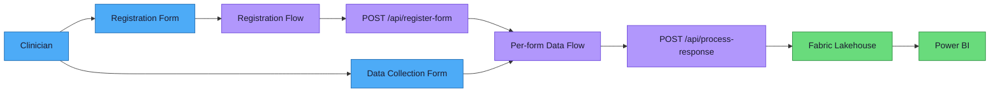

> **Note:** This is a proof-of-concept reference implementation, not a supported product. See [Disclaimer](#disclaimer) below.

# Forms to Fabric

A solution that enables clinicians to create questionnaires using Microsoft Forms and automatically pipelines response data into Microsoft Fabric for analytics and reporting.

## Architecture Overview



### Key Features

- **Zero learning curve**: Clinicians use Microsoft Forms — no new tools
- **Near-real-time data**: Responses appear in Fabric within minutes
- **PHI-aware**: Configurable de-identification per form (hash, redact, generalize)
- **Two-layer security**: Raw data (restricted) + curated data (de-identified)
- **Self-service reporting**: Power BI dashboard with DirectLake mode
- **Automated monitoring**: Schema change detection and RBAC compliance audits run on schedule
- **Self-service registration**: Clinicians register forms via a simple 3-question form — no email or IT ticket required for non-PHI forms
- **Admin CLI tools**: Registry management, key rotation, and flow generation scripts reduce manual work by 75%
- **Infrastructure as Code**: Fabric capacity, Azure Functions, Key Vault — all provisioned via Bicep and scripts

## Getting Started

### Prerequisites

- Azure subscription with Contributor access
- Microsoft 365 organizational account (for Forms)
- Microsoft Fabric workspace (or capacity to create one)
- Azure Developer CLI (`azd`) installed
- Python 3.11+

### Quick Start

```bash
# Clone and deploy
az login
git clone <repo-url>
cd forms-to-fabric
pwsh scripts/Setup-Environment.ps1
azd up
```

> **Service account recommended.** Power Automate flows run under the identity that creates them. Use a dedicated service account (not a personal account) for `Create-RegistrationFlow.ps1` and any flow connections so flows don't break when staff leave. See [Service Account Guide](docs/service-account-guide.md).

Then follow:

- [docs/setup-guide.md](docs/setup-guide.md) for the full deployment runbook
- [docs/deployment-prerequisites.md](docs/deployment-prerequisites.md) for tool, API, and environment requirements

## Documentation

| Document | Audience | Description |
|----------|----------|-------------|
| [Clinician Guide](docs/clinician-guide.md) | Clinicians | How to create forms and view your data |
| [E2E Walkthrough](docs/e2e-walkthrough.md) | Everyone | Visual end-to-end pipeline walkthrough with screenshots |
| [Admin Guide](docs/admin-guide.md) | IT / Admins | Register forms, configure de-id, manage access |
| [Architecture](docs/architecture.md) | IT Leadership | Data flow, security, and compliance |
| [Architecture Overview](docs/architecture-overview.md) | Everyone | Visual Mermaid diagrams of component integration |
| [Setup Guide](docs/setup-guide.md) | DevOps | Step-by-step deployment instructions |
| [Deployment Prerequisites](docs/deployment-prerequisites.md) | DevOps / Admins | Required tools, packages, APIs, and environment variables |
| [Service Account Guide](docs/service-account-guide.md) | IT / Admins | Recommended ownership model for flows, connectors, and alert mailbox |
| [Registration Form Template](docs/registration-form-template.md) | IT / Admins | Build the self-service intake form and registration flow |
| [FAQ](docs/faq.md) | Everyone | Common questions and answers |
| [Automation Gaps](docs/automation-gaps.md) | IT / DevOps | Admin burden assessment and remediation |
| [Decisions Log](docs/decisions.md) | Stakeholders | Key architectural and workflow decisions |
| [Pilot Program](docs/pilot-program.md) | Project leads | Suggested pilot rollout plan |
| [Rollout Checklist](docs/rollout-checklist.md) | Project leads | Go-live checklist for rollout readiness |
| [Workspace Architecture (Future State)](docs/workspace-architecture.md) | Architects | Proposed hybrid workspace model, not part of the current POC |
| [POC Checklist](docs/poc-checklist.md) | Anyone | Reusable checklist for building POC/reference projects |

## Project Structure

```
forms-to-fabric/
├── infra/              # Bicep infrastructure templates
├── src/functions/      # Azure Function App (Python)
│   ├── process_response/   # HTTP trigger — processes form submissions
│   ├── monitor_schema/     # Timer trigger — detects form changes
│   ├── audit_rbac/         # Timer trigger — audits workspace access
│   ├── generate_flow/      # HTTP trigger — generates PA flow definitions
│   └── shared/             # Shared modules (de-id, config, Graph, Fabric)
├── scripts/            # Admin CLI tools
│   ├── Manage-Registry.ps1     # Form registry management
│   ├── rotate_function_key.py  # Key rotation automation
│   ├── Generate-FlowBody.ps1   # PA flow body generator
│   ├── Setup-Environment.ps1   # One-command environment setup
│   ├── Setup-FabricWorkspace.ps1  # Fabric workspace provisioning
│   ├── Post-Deploy.ps1         # Post-deploy: Fabric access + key storage
│   ├── Redeploy.ps1            # Code-only Azure Functions redeploy
│   ├── Destroy-Environment.ps1 # Full teardown of Azure, Fabric, and PA flows
│   └── install-hooks.sh        # Install local git hooks
├── config/             # Form registry configuration + JSON schema
├── power-automate/     # Power Automate flow templates
├── e2e/                # Playwright E2E screenshot pipeline (Edge)
├── docs/               # Documentation
│   └── diagrams/       # Excalidraw source diagrams
├── hooks/              # Shared git hooks installed by install-hooks.sh
├── tests/              # Unit and integration tests
└── azure.yaml          # Azure Developer CLI manifest
```

## Contributing

1. Create a feature branch from `main`
2. Make your changes
3. Run tests: `cd src/functions && python -m pytest ../../tests/`
4. Submit a pull request

## Disclaimer

This repository is a **proof-of-concept and reference implementation** provided AS-IS under the MIT License. It is not supported by Microsoft, the repository authors, or any other party. No SLAs, warranties, or support commitments are provided. Organizations deploying this solution are responsible for their own security reviews, compliance validation, and ongoing maintenance.

See [DISCLAIMER.md](DISCLAIMER.md) for full details.

## License

This project is licensed under the [MIT License](LICENSE).
