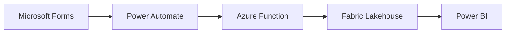

# Forms-to-Fabric Pipeline

A solution that enables clinicians to create questionnaires using Microsoft Forms and automatically pipelines response data into Microsoft Fabric for analytics and reporting.

## Architecture Overview



### Key Features

- **Zero learning curve**: Clinicians use Microsoft Forms — no new tools
- **Near-real-time data**: Responses appear in Fabric within minutes
- **PHI-aware**: Configurable de-identification per form (hash, redact, generalize)
- **Two-layer security**: Raw data (restricted) + curated data (de-identified)
- **Self-service reporting**: Power BI dashboard with DirectLake mode
- **Automated monitoring**: Schema change detection and RBAC compliance audits run on schedule
- **Admin CLI tools**: Registry management, key rotation, and flow generation scripts reduce manual work by 75%

## Getting Started

### Prerequisites

- Azure subscription with Contributor access
- Microsoft 365 organizational account (for Forms)
- Microsoft Fabric workspace (or capacity to create one)
- Azure Developer CLI (`azd`) installed
- Python 3.10+

### Quick Start

```bash
# Clone and deploy
git clone <repo-url>
cd forms-solution
azd up
```

See [docs/setup-guide.md](docs/setup-guide.md) for detailed deployment instructions.

## Documentation

| Document | Audience | Description |
|----------|----------|-------------|
| [Clinician Guide](docs/clinician-guide.md) | Clinicians | How to create forms and view your data |
| [Admin Guide](docs/admin-guide.md) | IT / Admins | Register forms, configure de-id, manage access |
| [Architecture](docs/architecture.md) | IT Leadership | Data flow, security, and compliance |
| [Setup Guide](docs/setup-guide.md) | DevOps | Step-by-step deployment instructions |
| [FAQ](docs/faq.md) | Everyone | Common questions and answers |
| [Automation Gaps](docs/automation-gaps.md) | IT / DevOps | Admin burden assessment and remediation |

## Project Structure

```
forms-solution/
├── infra/              # Bicep infrastructure templates
├── src/functions/      # Azure Function App (Python)
│   ├── process_response/   # HTTP trigger — processes form submissions
│   ├── monitor_schema/     # Timer trigger — detects form changes
│   ├── audit_rbac/         # Timer trigger — audits workspace access
│   ├── generate_flow/      # HTTP trigger — generates PA flow definitions
│   └── shared/             # Shared modules (de-id, config, Graph, Fabric)
├── scripts/            # Admin CLI tools
│   ├── manage_registry.py      # Form registry management
│   └── rotate_function_key.py  # Key rotation automation
├── config/             # Form registry configuration + JSON schema
├── power-automate/     # Power Automate flow templates
├── power-bi/           # Power BI report templates
├── docs/               # Documentation
├── tests/              # Unit and integration tests
└── azure.yaml          # Azure Developer CLI manifest
```

## Contributing

1. Create a feature branch from `main`
2. Make your changes
3. Run tests: `cd src/functions && python -m pytest ../../tests/`
4. Submit a pull request

## License

Private — All rights reserved.
