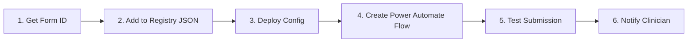
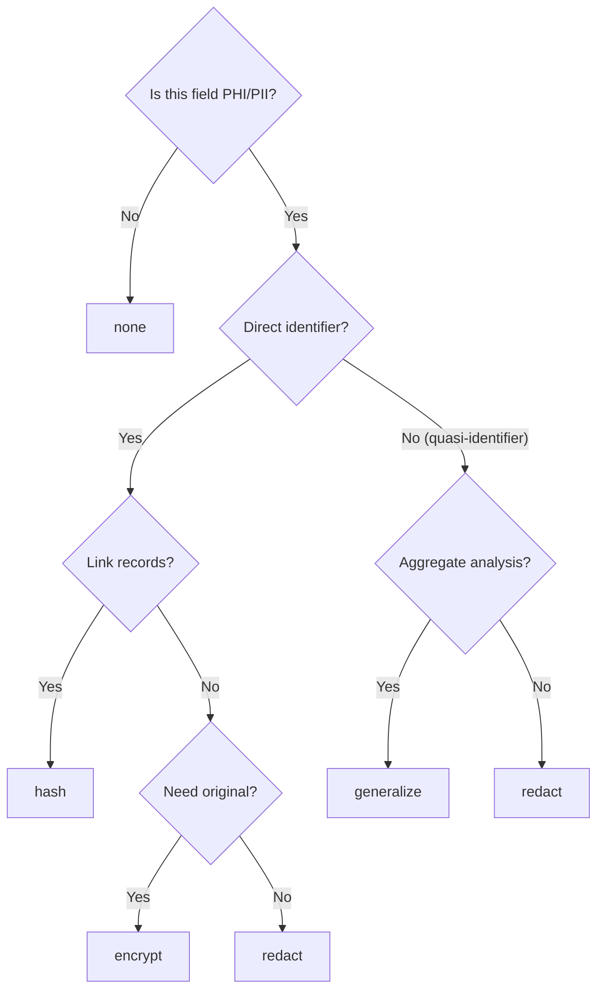
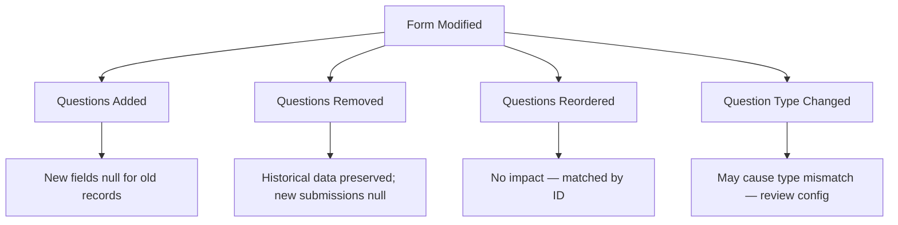
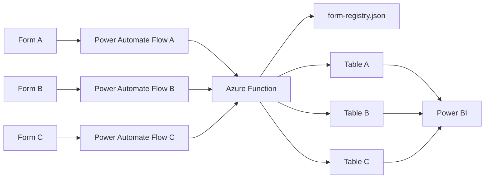

# Forms-to-Fabric Pipeline — Administration Guide

## Overview

This guide covers day-to-day administration of the Healthcare Forms-to-Fabric pipeline. As an admin, your responsibilities include registering new Microsoft Forms, configuring de-identification rules for PHI, managing Fabric workspace access, monitoring pipeline health, handling schema changes, rotating secrets, and planning for backup and recovery.

The pipeline flow is: **Microsoft Forms → Power Automate → Azure Function (`src/functions/process_response`) → Microsoft Fabric Lakehouse**. Configuration lives in `config/form-registry.json`, shared modules (de-identification, Fabric client) are in `src/functions/shared/`, and infrastructure is defined as Bicep templates in `infra/`.



---

## Registering a New Form

### Recommended: Use the Registry CLI

The `manage_registry.py` CLI tool provides a validated, error-proof way to manage form registrations. It prevents common mistakes like JSON syntax errors, duplicate form IDs, and missing de-identification settings.

**Step 1 — Get the form ID from the clinician's URL:**

The clinician sends you their form link. Extract the form ID:

```bash
python scripts/manage_registry.py lookup-id "https://forms.office.com/Pages/DesignPageV2.aspx?id=abc123-def456&..."
# Output: Form ID: abc123-def456
```

**Step 2 — Register the form:**

```bash
python scripts/manage_registry.py add-form \
  --form-id "abc123-def456" \
  --form-name "Patient Satisfaction Survey" \
  --target-table "patient_satisfaction"
```

**Add fields to the form:**

```bash
python scripts/manage_registry.py add-field \
  --form-id "abc123-def456" \
  --question-id "q1" \
  --field-name "patient_name" \
  --contains-phi \
  --deid-method "redact"
```

**Validate the registry:**

```bash
python scripts/manage_registry.py validate
```

**List all registered forms:**

```bash
python scripts/manage_registry.py list
```

> **Tip:** Always run `validate` before deploying. The CLI catches syntax errors, missing fields, and configuration conflicts that would break the pipeline.

If you prefer to edit the JSON directly, follow the manual steps below.

### Step 1: Get the Form ID from Microsoft Forms

1. Open [Microsoft Forms](https://forms.office.com) and navigate to the target form.
2. Click **Share** or look at the browser URL. The Form ID is the GUID in the URL:
   ```
   https://forms.office.com/Pages/DesignPageV2.aspx?id=abc123-def456&...
                                                        ^^^^^^^^^^^^^^
                                                        This is the Form ID
   ```
3. Copy the Form ID — you'll need it for the registry entry.

### Step 2: Add an Entry to `config/form-registry.json`

Open `config/form-registry.json` and add a new object to the forms array. Each entry maps a Microsoft Form to a Fabric Lakehouse table and defines how each field should be processed.

### Step 3: Define the Full Configuration Entry

Below is a complete example entry:

```json
{
  "form_id": "abc123-def456",
  "form_name": "Patient Satisfaction Survey",
  "description": "Post-visit satisfaction questionnaire",
  "department": "Cardiology",
  "owner_email": "dr.smith@hospital.org",
  "created_date": "2025-01-15",
  "target_table": "patient_satisfaction",
  "fields": [
    {
      "question_id": "q1",
      "question_text": "Patient Name",
      "field_name": "patient_name",
      "data_type": "string",
      "sensitivity": "direct_identifier",
      "de_identification": {
        "method": "redact",
        "replacement": "[REDACTED]"
      }
    },
    {
      "question_id": "q2",
      "question_text": "Date of Birth",
      "field_name": "date_of_birth",
      "data_type": "date",
      "sensitivity": "quasi_identifier",
      "de_identification": {
        "method": "generalize",
        "granularity": "year"
      }
    },
    {
      "question_id": "q3",
      "question_text": "Overall satisfaction (1-5)",
      "field_name": "satisfaction_rating",
      "data_type": "integer",
      "sensitivity": "non_sensitive",
      "de_identification": {
        "method": "none"
      }
    }
  ]
}
```

**Key fields explained:**

| Field | Purpose |
|---|---|
| `form_id` | The GUID from the Microsoft Forms URL |
| `target_table` | Destination table name in Fabric Lakehouse |
| `question_id` | Maps to the question identifier in the Forms response JSON |
| `sensitivity` | Determines de-identification behavior (see [Configuring De-Identification Rules](#configuring-de-identification-rules)) |
| `de_identification` | Specifies the method and parameters for transforming sensitive data |

### Step 4: Deploy the Updated Configuration

After updating `config/form-registry.json`, deploy the changes:

```bash
# Using Azure Developer CLI (recommended)
azd deploy

# Or update the configuration directly in the Azure Portal:
# Function App → Configuration → Application settings
```

Commit the updated registry to Git first so changes are tracked:

```bash
git add config/form-registry.json
git commit -m "Register new form: Patient Satisfaction Survey"
git push
```

### Step 5: Create the Power Automate Flow

#### Option A: Generate and Import a Flow (Recommended)

Use the `generate-flow` admin endpoint to produce a ready-to-import flow definition — this reduces setup from ~15 minutes to ~2 minutes.

1. **Call the endpoint** to generate the flow JSON for your form:
   ```
   GET https://<function-app>.azurewebsites.net/api/generate-flow?form_id=<id>&code=<function-key>
   ```
   You can also pass optional `function_app_url` and `key_vault_name` query parameters to override the defaults.

2. **Save the response** as a `.json` file (e.g. `my-form-flow.json`).

3. In **Power Automate**, go to **My Flows → Import → Import Package (Legacy)**.

4. **Upload** the JSON file.

5. **Configure connections** — you will be prompted to link your Microsoft Forms, Azure Key Vault, and Office 365 Outlook connections.

6. **Done** — the flow is ready to use. Submit a test response to verify end-to-end processing.

#### Option B: Create a Flow Manually (Fallback)

1. Open [Power Automate](https://make.powerautomate.com).
2. Create a new **Automated cloud flow**.
3. Set the trigger to **When a new response is submitted** (Microsoft Forms connector).
4. Select the form you registered.
5. Add a **Get response details** action to retrieve the full response.
6. Add an **HTTP** action to call the Azure Function:
   - **Method:** POST
   - **URI:** `https://<your-function-app>.azurewebsites.net/api/process_response`
   - **Headers:** `x-functions-key: <function-key-from-key-vault>`
   - **Body:** The response details JSON from the previous step, including `form_id`
7. Save and test the flow.

See the `power-automate/` directory for reference flow templates.

### Step 6: Test with a Sample Submission

1. Open the form and submit a test response.
2. Verify the Power Automate flow ran successfully (check flow run history).
3. Confirm the Azure Function executed (check Application Insights).
4. Validate data landed in the Fabric Lakehouse target table.
5. Check that de-identification was applied correctly (sensitive fields should be transformed).

---

## Configuring De-Identification Rules

The de-identification engine in `src/functions/shared/` processes each field according to its `sensitivity` level and configured `de_identification` method. This is critical for HIPAA compliance.

### Sensitivity Levels

| Level | Description | Examples | Default Action |
|---|---|---|---|
| `direct_identifier` | Data that directly identifies a person | Name, email, MRN, phone number, SSN | Always de-identified |
| `quasi_identifier` | Data that could identify when combined with other data | Date of birth, postal code, department, admission date | Generalized to reduce precision |
| `non_sensitive` | Safe data with no identification risk | Satisfaction ratings, yes/no answers, Likert scales | Passed through unchanged |

### De-Identification Methods

| Method | Behavior | Use When | Reversible |
|---|---|---|---|
| `redact` | Replace value with placeholder text (e.g., `[REDACTED]`) | Direct identifiers that don't need linkability | No |
| `hash` | One-way SHA-256 hash of the value | You need to link records across submissions without revealing the actual value (e.g., tracking a patient across multiple forms) | No |
| `generalize` | Reduce precision of the value | Quasi-identifiers where aggregate analysis is needed | No |
| `encrypt` | AES encryption using a key stored in Azure Key Vault | Authorized personnel may need to re-identify for clinical follow-up | Yes |
| `none` | No transformation; value passes through as-is | Non-sensitive data | N/A |

### Generalization Options

The `generalize` method supports a `granularity` parameter:

| Data Type | Granularity Options | Example |
|---|---|---|
| `date` | `year`, `month`, `quarter` | `1990-03-15` → `1990` (year) |
| `integer` (age) | `decade`, `range_5` | `67` → `60-69` (decade) |
| `string` (postal) | `prefix_3`, `prefix_4` | `V6B 3K9` → `V6B` (prefix_3) |

### Decision Guide: Choosing the Right Method

Use this decision tree when mapping a new form field:



---

## Managing Fabric Workspace Access

### RBAC Roles

Microsoft Fabric workspaces use the following roles:

| Role | Permissions |
|---|---|
| **Admin** | Full control — manage access, delete workspace, configure settings |
| **Member** | Create and edit all content, share items, but cannot manage access |
| **Contributor** | Create and edit content, but cannot share or manage access |
| **Viewer** | View content only — no editing or creation |

### Role Assignments

| Persona | Role | Scope | Rationale |
|---|---|---|---|
| IT Admins | Admin | All workspaces | Full pipeline management |
| Azure Function managed identity | Contributor | Production workspace | Write processed data to Lakehouse tables |
| Department leads | Contributor | Their department's workspace | Manage department-specific reports and datasets |
| Clinicians viewing dashboards | Viewer | Curated workspace | View Power BI reports; no data modification |
| Power BI report creators | Contributor | Reporting workspace | Build and edit dashboards and reports |

### Managing Access

1. Open the [Fabric portal](https://app.fabric.microsoft.com).
2. Navigate to **Workspaces** → select the target workspace.
3. Click **Manage access** (gear icon in the top right).
4. Click **Add people or groups** and assign the appropriate role.

### Layer Access Control

> **Important:** The pipeline writes to two layers in the Lakehouse:
>
> - **Raw layer** — Contains original (potentially identifiable) response data. Access restricted to **IT Admins only**.
> - **Curated layer** — Contains de-identified data. Shared with department leads and clinicians via the Viewer or Contributor roles.
>
> Never grant non-admin users access to the raw layer.

---

## Monitoring Pipeline Health

### Application Insights Dashboard

The Azure Function is instrumented with Application Insights. Access it via:

1. Azure Portal → your Function App → **Application Insights** (left nav).
2. Or directly at `https://portal.azure.com` → Application Insights resource.

### Key Metrics to Monitor

| Metric | Healthy Range | Concern Threshold |
|---|---|---|
| Function execution count | Matches expected form submissions | Sudden drop to zero |
| Success rate | > 99% | < 95% |
| Average execution duration | < 10 seconds | > 30 seconds |
| Fabric write latency | < 5 seconds | > 15 seconds |
| Failed executions | 0 | Any failures |

### Setting Up Alerts

Configure the following alerts in Application Insights → **Alerts** → **New alert rule**:

1. **Function failure rate > 5%**
   - Signal: `requests` where `success == false`
   - Condition: Percentage > 5% over a 15-minute window
   - Action: Email IT admin group

2. **Execution duration > 30 seconds**
   - Signal: `requests` duration
   - Condition: Average > 30,000 ms over a 5-minute window
   - Action: Email IT admin group

3. **No executions in 24 hours** (for active forms)
   - Signal: `requests` count
   - Condition: Total == 0 over 24 hours
   - Action: Email IT admin group (may indicate a broken flow or form issue)

### KQL Log Queries

Open Application Insights → **Logs** and run these queries:

**Find failed executions:**

```kql
requests
| where success == false
| where timestamp > ago(7d)
| project timestamp, name, resultCode, duration, operation_Id
| order by timestamp desc
```

**Track processing latency by form:**

```kql
requests
| where timestamp > ago(24h)
| where name == "process_response"
| extend formId = tostring(customDimensions["form_id"])
| summarize avgDuration=avg(duration), p95Duration=percentile(duration, 95), count() by formId
| order by avgDuration desc
```

**Identify forms with errors:**

```kql
requests
| where success == false
| where timestamp > ago(7d)
| extend formId = tostring(customDimensions["form_id"])
| summarize failureCount=count(), lastFailure=max(timestamp) by formId
| order by failureCount desc
```

**View end-to-end transaction for a specific execution:**

```kql
union requests, dependencies, exceptions
| where operation_Id == "<operation-id-from-failed-request>"
| order by timestamp asc
```

### Power Automate Flow Run History

1. Open [Power Automate](https://make.powerautomate.com) → **My flows**.
2. Select the flow for the form in question.
3. Click **Run history** to see recent executions, status, and duration.
4. Click a failed run to see which step failed and the error message.

### Automated Schema Change Detection

The `monitor_schema` function runs every 6 hours and automatically detects when clinicians modify their forms. It compares the live form structure (via Microsoft Graph API) against the registered configuration in `form-registry.json`.

**What it detects:**
- **Added questions** — new questions not yet in the registry
- **Removed questions** — questions in the registry that no longer exist in the form
- **Renamed questions** — same question ID but different title text

**When changes are detected:**
- A warning is logged to Application Insights (searchable via the KQL queries above)
- If `ADMIN_ALERT_EMAIL` is configured, an email notification is sent

**KQL query to find schema change alerts:**

```kql
traces
| where message contains "schema change detected"
| where timestamp > ago(7d)
| extend formId = tostring(customDimensions["form_id"])
| project timestamp, formId, message
| order by timestamp desc
```

**What to do when changes are detected:**
1. Review the change report in Application Insights
2. Update `form-registry.json` using the CLI: `python scripts/manage_registry.py add-field ...`
3. Classify any new fields for sensitivity and de-identification
4. Deploy: `azd deploy`
5. Test with a sample submission

### Automated RBAC Compliance Audit

The `audit_rbac` function runs daily at 8:00 AM UTC and verifies that Fabric workspace access controls are correctly configured.

**What it checks:**
- Only the allowed admin group (configured via `ALLOWED_RAW_ACCESS_GROUP` env var) has Contributor/Member/Admin access to the workspace
- The Function App's managed identity is allowed (required for data writes)
- Viewer-role assignments are not flagged (read-only access to curated data is expected)

**When violations are detected:**
- A WARNING-level log is written to Application Insights with the violating principal's details
- Configure an Application Insights alert rule on these warnings for real-time notification

**KQL query to find RBAC violations:**

```kql
traces
| where severityLevel >= 2
| where message contains "RBAC violation"
| where timestamp > ago(30d)
| project timestamp, message, customDimensions
| order by timestamp desc
```

---

## Handling Schema Changes

When clinicians modify forms (add, remove, or reorder questions), the field mappings in the registry must be updated to match.

### Step 1: Detect the Change

Schema changes can be detected through:
- **Monitoring alert**: The Azure Function logs a warning when it encounters an unmapped `question_id`.
- **Clinician notification**: The form owner emails the admin team before or after making changes.
- **Failed executions**: If a required field is missing, the function may fail.

Check Application Insights for schema mismatch warnings:

```kql
traces
| where message contains "unmapped question" or message contains "schema mismatch"
| where timestamp > ago(7d)
| order by timestamp desc
```

### Step 2: Update `config/form-registry.json`

1. Open the form in Microsoft Forms to see the current questions.
2. Compare with the existing registry entry.
3. Add new field mappings for added questions.
4. **Do not remove** field mappings for deleted questions — mark them as deprecated instead:

```json
{
  "question_id": "q_old",
  "question_text": "Removed Question",
  "field_name": "old_field",
  "data_type": "string",
  "sensitivity": "non_sensitive",
  "de_identification": { "method": "none" },
  "deprecated": true,
  "deprecated_date": "2025-06-01"
}
```

### Step 3: Handle Backward Compatibility

- **New fields**: Will have `null` values for historical records submitted before the field existed.
- **Removed fields**: Historical data is preserved in the Lakehouse. New submissions will have `null` for the removed field.
- **Reordered fields**: No impact — fields are matched by `question_id`, not position.

### Step 4: Redeploy the Configuration

```bash
git add config/form-registry.json
git commit -m "Update schema: Patient Satisfaction Survey — added q4, deprecated q_old"
git push
azd deploy
```

### Step 5: Test with the Modified Form

Submit a test response using the modified form and verify:
- New fields are captured and de-identified correctly.
- Existing fields still process as expected.
- No errors in Application Insights.

> **Note:** Removing questions from a form does not delete historical data in the Lakehouse. The raw and curated layers retain all previously processed records.



---

## Rotating Secrets in Key Vault

### Function App Key Rotation

Rotate the function key used by Power Automate to call the Azure Function.

#### Automated rotation (recommended)

Use the rotation script to generate a new host key and update Key Vault in one step:

```bash
python scripts/rotate_function_key.py \
  --function-app <function-app-name> \
  --resource-group <resource-group> \
  --key-vault <keyvault-name>
```

Preview first with `--dry-run`:

```bash
python scripts/rotate_function_key.py \
  --function-app <function-app-name> \
  --resource-group <resource-group> \
  --key-vault <keyvault-name> \
  --dry-run
```

The script will:
1. Generate a new host key named `power-automate-YYYY-MM-DD` on the Function App.
2. Store the new key in Key Vault as the secret `function-app-key`.
3. Print the names of any old `power-automate-*` keys for manual cleanup.

If your Power Automate flow uses the **Key Vault connector** (see `power-automate/flow-template-keyvault.json`), it reads the function key from Key Vault at runtime. After running the rotation script, **no flow edits are required** — every subsequent flow run automatically picks up the new key with zero downtime.

> **Note:** The Key Vault secret `function-app-key` is deployed with a 90-day expiry attribute. Set a calendar reminder or Azure Monitor alert to rotate before it expires.

#### Manual rotation (fallback)

If you cannot run the script, perform the rotation manually:

1. **Generate a new key** in the Azure Portal:
   - Function App → **App keys** → **New host key**
   - Name it with a date suffix (e.g., `power-automate-2025-07`)
   - Copy the new key value

2. **Update the Key Vault secret:**
   ```bash
   az keyvault secret set \
     --vault-name <your-keyvault-name> \
     --name "function-app-key" \
     --value "<new-key-value>"
   ```

3. **Verify the flow still works:**
   - Submit a test form response
   - Confirm the flow runs successfully and data reaches Fabric

4. **Disable the old key:**
   - Function App → **App keys** → select the old key → **Delete**

### Rotation Schedule

| Secret | Recommended Rotation | Owner |
|---|---|---|
| Function app host key | Every 90 days | IT Admin |
| Service principal client secret | Every 90 days | IT Admin |
| Encryption keys (for `encrypt` de-id method) | Every 365 days | Security team |

### Fabric Connection Credentials

If using a service principal for Fabric access:

1. Generate a new client secret in Azure AD → App registrations → your app → **Certificates & secrets**.
2. Update the Key Vault secret for the Fabric connection.
3. Restart the Function App to pick up the new credential:
   ```bash
   az functionapp restart --name <function-app-name> --resource-group <resource-group>
   ```
4. Verify data writes to Fabric succeed.
5. Delete the old client secret from Azure AD.

---

## Scaling Considerations

### Azure Functions

| Plan | Characteristics | When to Use |
|---|---|---|
| **Consumption** | Auto-scales to zero; pay per execution; cold starts (5–10s) | < 1,000 responses/day; cost-sensitive |
| **Premium (EP1+)** | Pre-warmed instances; no cold starts; VNET integration | > 1,000 responses/day; low-latency requirements |
| **Dedicated (App Service)** | Fixed instances; predictable cost | Consistent high volume; existing App Service plan |

For most healthcare forms workloads, the **Consumption plan** is sufficient. Switch to **Premium** if:
- Cold starts cause Power Automate flow timeouts (> 30 seconds).
- You process more than 1,000 form responses per day.
- You need VNET integration for network isolation.

### Fabric Capacity

- Monitor Capacity Unit (CU) usage in the Fabric admin portal → **Capacity settings**.
- Each Lakehouse write consumes CUs — high-volume forms can impact other Fabric workloads.
- Consider a dedicated capacity for the pipeline if it shares with other analytics workloads.

### Power Automate Throttling Limits

| Limit | Value |
|---|---|
| Actions per flow run | 500,000 |
| Flow runs per 5 minutes (per flow) | 600 |
| Concurrent outbound HTTP calls | 500 |
| API requests per 24 hours (per user/per connection) | Varies by license (typically 10,000–25,000) |

If you hit throttling limits:
- Implement retry logic with exponential backoff in the flow.
- Distribute load across multiple flows.
- Consider batching responses (collect multiple, then send to the function in one call).

### Multi-Form Scaling

- Each form gets its own Power Automate flow.
- The Azure Function in `src/functions/process_response` handles routing — it reads the `form_id` from the request and looks up the matching configuration in `config/form-registry.json`.
- Adding more forms does not require code changes, only configuration updates.



---

## Backup and Recovery

### What's Version-Controlled (Git)

These components are stored in this repository and can be redeployed at any time:

| Component | Location | Recovery Method |
|---|---|---|
| Form registry configuration | `config/form-registry.json` | `git checkout` + `azd deploy` |
| Azure Function code | `src/functions/` | `git checkout` + `azd deploy` |
| Shared modules | `src/functions/shared/` | `git checkout` + `azd deploy` |
| Infrastructure (Bicep) | `infra/` | `git checkout` + `azd up` |
| Power Automate flow templates | `power-automate/` | Re-import into Power Automate |
| Power BI reports | `power-bi/` | Re-publish to Power BI Service |

### Fabric Data Backup

| Layer | Retention Policy | Backup Strategy |
|---|---|---|
| **Raw layer** | Retained indefinitely (append-only) | Primary source of truth; schedule weekly OneLake snapshots |
| **Curated layer** | Derived from raw layer | Can be fully regenerated by reprocessing raw data |

**Recommended backup schedule:**
- Weekly OneLake snapshots of the raw layer.
- On-demand snapshots before major configuration changes.

### Azure Key Vault Recovery

- **Soft-delete** is enabled by default with a 90-day retention period.
- Accidentally deleted secrets can be recovered:
  ```bash
  az keyvault secret recover --vault-name <vault-name> --name <secret-name>
  ```
- **Purge protection** is recommended — once enabled, deleted secrets cannot be permanently removed until the retention period expires.

### Disaster Recovery

To recover the full pipeline in a new Azure region:

1. **Redeploy infrastructure and code:**
   ```bash
   azd env new <disaster-recovery-env>
   azd env set AZURE_LOCATION <new-region>
   azd up
   ```

2. **Restore configuration:**
   - The form registry deploys with the code (it's in Git).
   - Re-create Key Vault secrets in the new region.
   - Update Power Automate flows to point to the new Function App URL.

3. **Restore data:**
   - Copy OneLake snapshots to the new Fabric workspace.
   - Or reprocess from source if snapshots are unavailable.

### RTO/RPO Targets

| Component | RTO (Recovery Time) | RPO (Recovery Point) |
|---|---|---|
| Pipeline (Function + infrastructure) | 4 hours | 0 (code is in Git) |
| Configuration | 4 hours | 0 (config is in Git) |
| Fabric data (raw layer) | 8 hours | 1 week (snapshot interval) |
| Fabric data (curated layer) | 12 hours | Regenerable from raw layer |
| Key Vault secrets | 1 hour | 0 (soft-delete recovery) |

> **Recommendation:** For production healthcare workloads, consider reducing the raw layer RPO to 1 hour by increasing snapshot frequency or enabling continuous replication if supported by your Fabric capacity.
