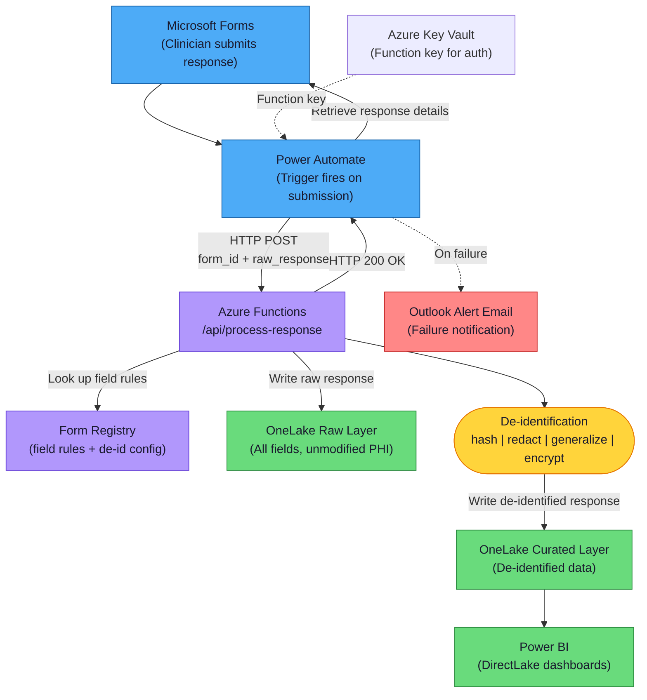
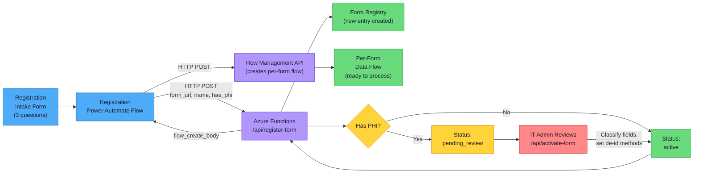
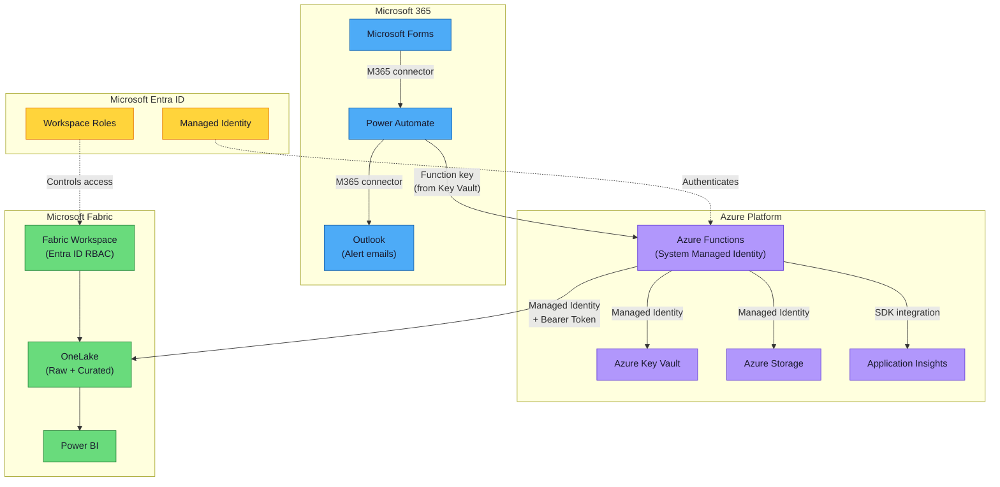
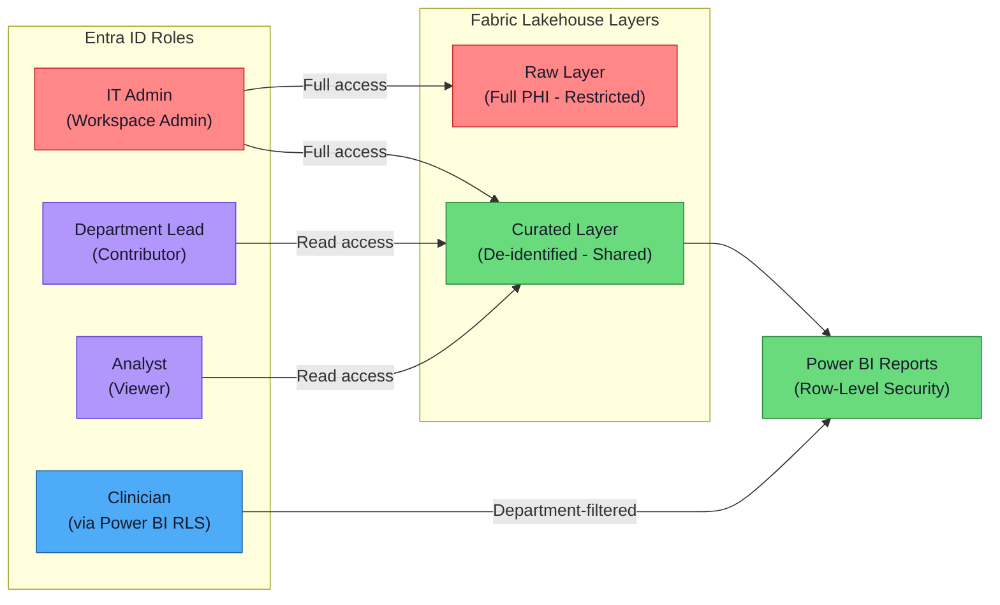
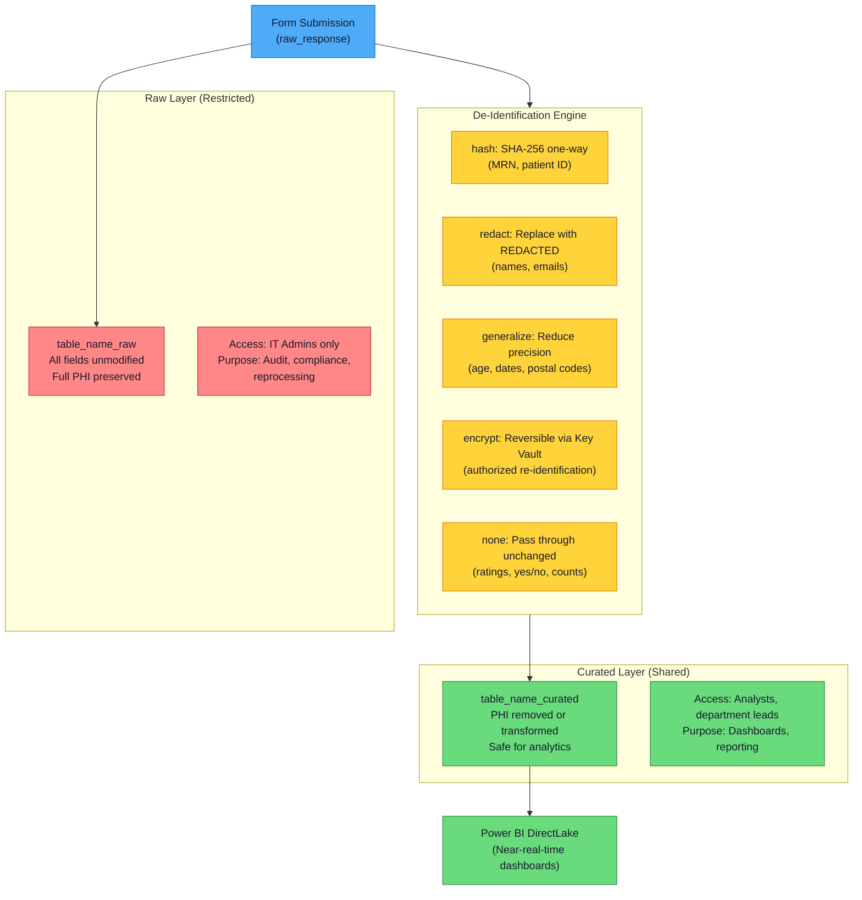
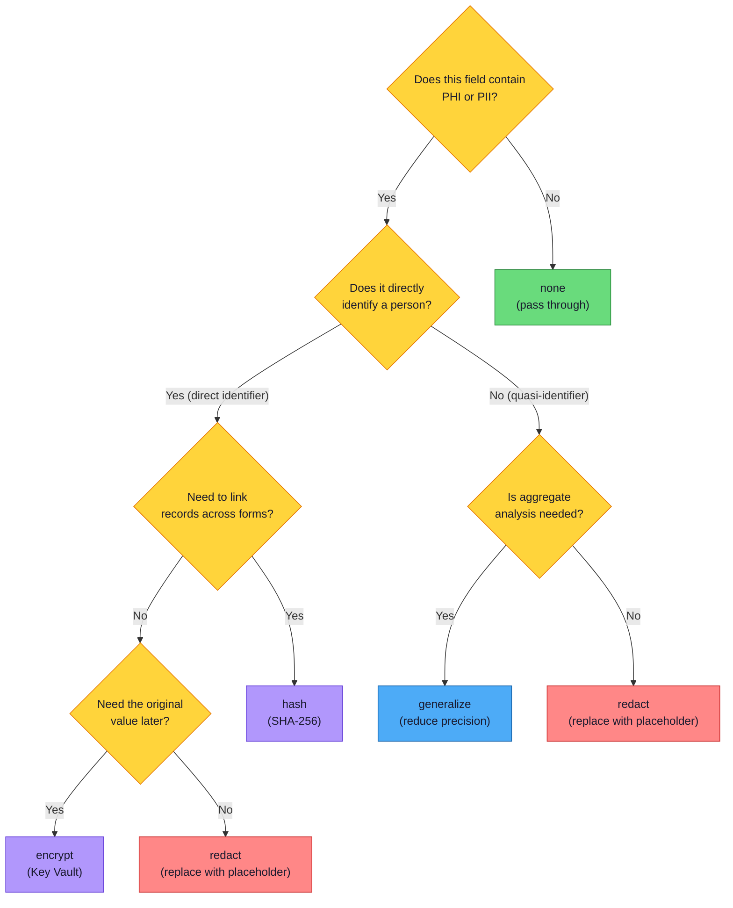

# Forms to Fabric — Architecture Overview

> **Audience:** IT Leadership, Developers, New Team Members
> **Purpose:** Visual architecture reference showing how all Microsoft components integrate
> **See also:** [Architecture (detailed)](architecture.md) for compliance, DR, and network details

---

## Contents

- [Component Map](#component-map)
- [End-to-End Data Flow](#end-to-end-data-flow)
- [Self-Service Registration Flow](#self-service-registration-flow)
- [Security and Identity](#security-and-identity)
- [Two-Layer Data Model](#two-layer-data-model)

<!--
  Standard dual-mode Mermaid palette (WCAG AA compliant on light and dark backgrounds).
  Copy the classDef block below into each diagram.

  classDef primary fill:#4dabf7,stroke:#1864ab,color:#1a1a2e
  classDef success fill:#69db7c,stroke:#2b8a3e,color:#1a1a2e
  classDef warning fill:#ffd43b,stroke:#e67700,color:#1a1a2e
  classDef danger fill:#ff8787,stroke:#c92a2a,color:#1a1a2e
  classDef info fill:#b197fc,stroke:#6741d9,color:#1a1a2e
  classDef neutral fill:#ced4da,stroke:#495057,color:#1a1a2e
-->

---

## Component Map

| Component | Type | Role |
|---|---|---|
| **Microsoft Forms** | M365 — Data Capture | Clinicians create and submit structured questionnaires. Responses are transient — no long-term PHI in Forms. |
| **Power Automate** | M365 — Orchestration | Triggers on form submission, retrieves response details, POSTs to Azure Function, sends failure alerts via Outlook. |
| **Azure Functions** (Python 3.11) | Azure — Processing | Validates payloads, looks up form config, writes raw data, applies de-identification, writes curated data. 6 HTTP + 3 timer endpoints. |
| **Azure Key Vault** | Azure — Secrets | Stores function keys and encryption keys. Accessed only via managed identity. Soft-delete + purge protection enabled. |
| **Azure Storage** | Azure — Infrastructure | Backing store for Functions runtime. Hosts `form-registry.json` blob in `form-registry` container. |
| **Application Insights** | Azure — Monitoring | Tracks function performance, error rates, custom metrics (records processed, de-id operations, schema changes). |
| **Fabric Capacity** | Fabric — Compute | Allocates compute for analytics. Provisioned via Bicep (F2 dev to F64 prod). Suspendable nightly via GitHub Actions. |
| **Fabric Lakehouse** | Fabric — Storage | Two-layer architecture: raw (PHI, restricted) + curated (de-identified, shared). Delta Lake format with ACID and time travel. |
| **OneLake** | Fabric — File Store | Cloud storage backend using Parquet/Delta. URI: `abfss://{workspace}@onelake.dfs.fabric.microsoft.com/{lakehouse}/Tables/...` |
| **Power BI** | Fabric — Reporting | DirectLake mode for near-real-time queries on curated data. Row-level security for department-scoped access. |
| **Microsoft Entra ID** | Identity — RBAC | Manages workspace roles (Admin for raw layer, Contributor/Viewer for curated). Groups-based access control. |
| **Microsoft Graph API** | M365 — Metadata | Used by schema monitor to retrieve live form structure and detect question changes. |

---

## End-to-End Data Flow

This diagram shows the complete path of a single form submission — from clinician input through to Power BI dashboards.

**Key points:**
- Power Automate authenticates to Azure Functions using a **function key** retrieved from Key Vault
- De-identification happens **inside** Azure Functions — between the raw write and curated write
- On failure, Power Automate sends an **Outlook alert email** to the configured admin address
- Power BI uses **DirectLake mode** — it queries OneLake directly with no ETL or data copy

---

## Self-Service Registration Flow

Clinicians register new forms through a simple 3-question intake form. The system automatically creates a per-form Power Automate data flow.

**Key points:**
- Clinicians answer 3 questions: form URL, short description, and whether it contains patient info
- Forms flagged with PHI enter **pending_review** — they cannot process submissions until IT activates them
- IT classifies each field with a de-identification method (hash, redact, generalize, encrypt, or none)
- Once activated, the per-form Power Automate flow begins processing submissions automatically

---

## Security and Identity

Every connection between components uses a specific authentication method. No credentials are stored in code.

### Authentication Methods Summary

| Connection | Method | Details |
|---|---|---|
| Power Automate → Azure Functions | **Function Key** | Stored in Key Vault as `function-app-key`. Rotatable via `rotate_function_key.py`. |
| Azure Functions → Key Vault | **Managed Identity** | System-assigned. `DefaultAzureCredential` in Python. No secrets in config. |
| Azure Functions → Azure Storage | **Managed Identity** | RBAC-based access to blob storage (form registry). |
| Azure Functions → OneLake | **Managed Identity + Bearer Token** | Token acquired via `DefaultAzureCredential`, passed to deltalake SDK. |
| Azure Functions → Fabric API | **Managed Identity + Bearer Token** | Scope: `https://api.fabric.microsoft.com/.default`. Used by RBAC auditor. |
| Power Automate → Forms | **M365 Connector** | Automatic via M365 tenant. User-delegated or service account connection. |
| Power Automate → Outlook | **M365 Connector** | Sends failure alert emails to admin address. |
| Fabric Workspace Access | **Entra ID RBAC** | Admin role → raw layer. Contributor/Viewer → curated layer. |

### Entra ID RBAC for Fabric

---

## Two-Layer Data Model

Every form submission is written to **two layers** in the Fabric Lakehouse. The raw layer preserves all original data for audit and compliance. The curated layer contains only de-identified data for analytics.

### De-Identification Methods

| Method | Transformation | Use Case | Example | Reversible? |
|---|---|---|---|---|
| **hash** | SHA-256 one-way hash | Direct identifiers requiring linkage (MRN, patient ID) | `"MRN-12345"` → `"a3f2b8c9d..."` | No |
| **redact** | Replace with `[REDACTED]` | Names, emails, free-text identifiers | `"John Smith"` → `"[REDACTED]"` | No |
| **generalize** | Reduce precision based on field type | Quasi-identifiers (age, postal code, date) | Age `35` → `"30-39"` | No |
| **encrypt** | Reversible encryption (Key Vault key) | Fields requiring authorized re-identification | Original value → encrypted blob | Yes |
| **none** | Pass through unchanged | Non-identifying data (counts, ratings, yes/no) | `"5"` → `"5"` | N/A |

### De-Identification Decision Tree

---

*Last updated: 2026-03-25. See [architecture.md](architecture.md) for compliance details, disaster recovery, and network architecture.*
