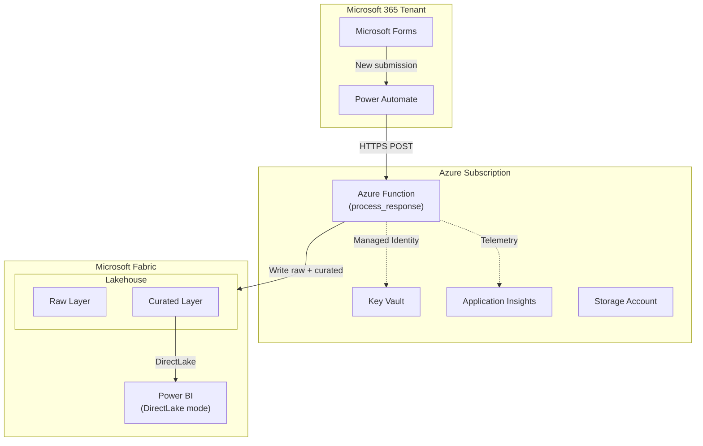
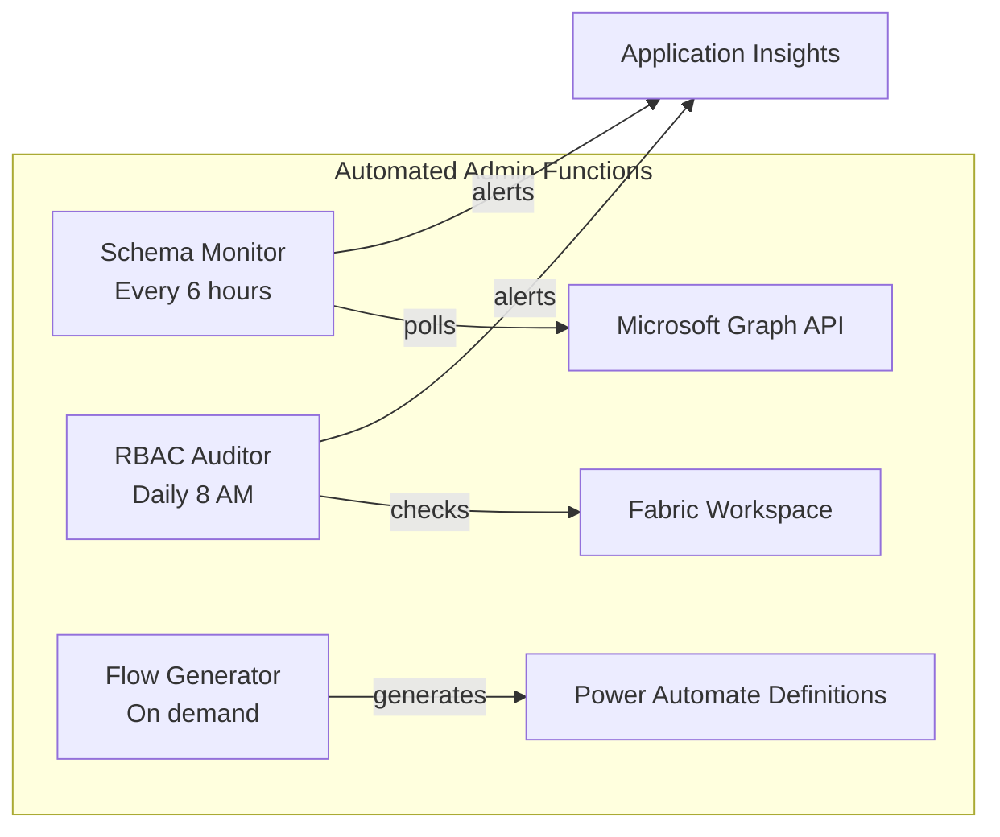
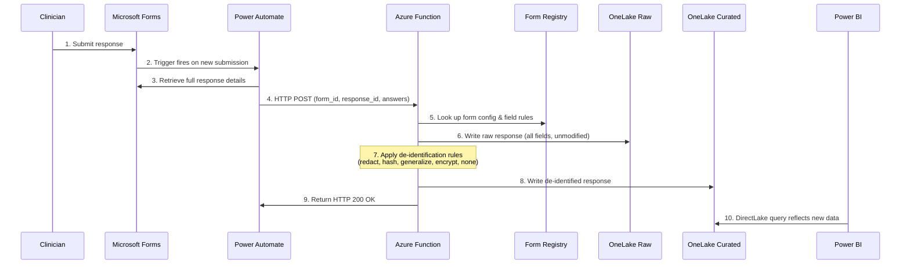
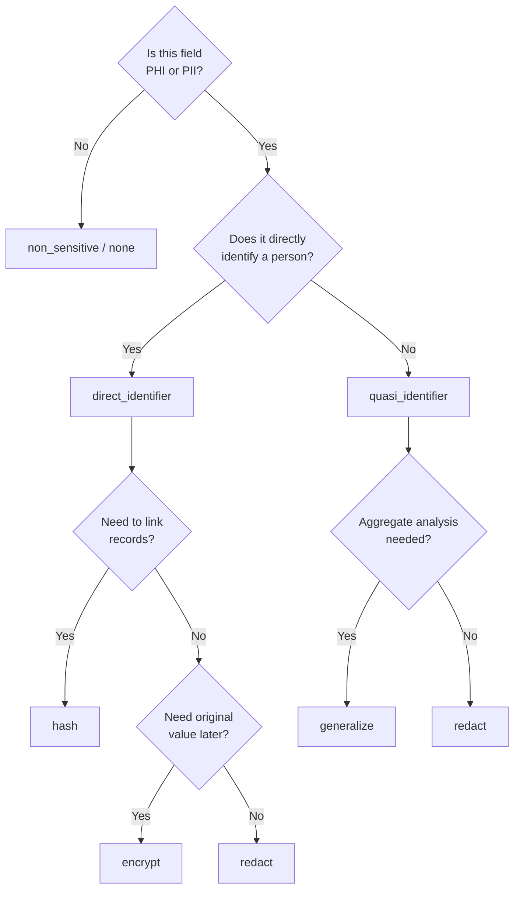
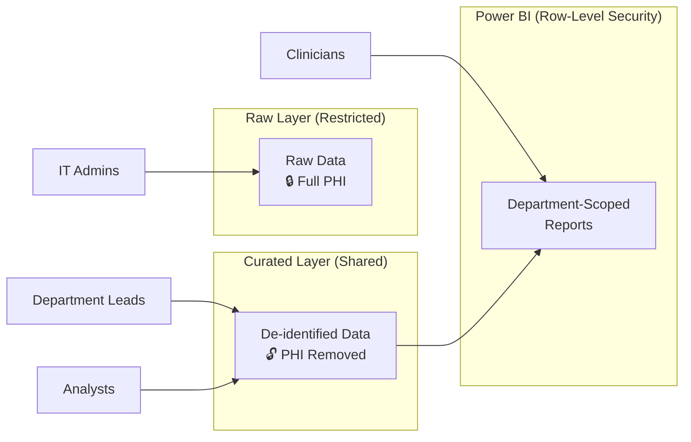

# Forms-to-Fabric Pipeline — Architecture

> **Audience:** IT Leadership, Security, and Compliance Teams
> **Last Updated:** 2025-07-15
> **Classification:** Internal — Restricted

---

## System Overview

The Forms-to-Fabric pipeline enables clinicians to submit structured data through Microsoft Forms, which is automatically processed, de-identified, and delivered to a Microsoft Fabric Lakehouse for analytics and reporting. The pipeline is fully contained within the Microsoft cloud ecosystem, requires no third-party services, and enforces a two-layer data model that separates protected health information (PHI) from reporting-ready data.

All infrastructure is defined as code using Bicep and deployed via the Azure Developer CLI (`azd`). Secrets are managed through Azure Key Vault, and observability is provided by Application Insights.

### Architecture Diagram

---

## Component Descriptions

| Component | Role | Key Details |
|---|---|---|
| **Microsoft Forms** | Data capture | Clinicians create and submit structured forms. Responses are transient; no PHI is stored long-term in Forms. Lives within the M365 tenant. |
| **Power Automate** | Event-driven trigger | Detects new form submissions and retrieves full response details. Sends an HTTPS POST to the Azure Function. Handles error notifications to operations staff. |
| **Azure Function (Python)** | Core processing engine | Validates the incoming payload, looks up per-form configuration in `form-registry.json`, applies de-identification rules, and writes to both raw and curated Lakehouse layers. Runs on a Consumption plan. Authenticates to downstream services via managed identity. |
| **Azure Key Vault** | Secrets management | Stores function keys, connection strings, and encryption keys. Accessed exclusively via managed identity — no credentials in code or configuration files. Soft-delete and purge protection enabled. |
| **Application Insights** | Monitoring and diagnostics | Tracks function execution performance, error rates, and custom metrics (e.g., records processed, de-identification operations). Powers operational alerting and dashboards. |
| **Storage Account** | Function infrastructure | Provides the backing store required by the Azure Functions runtime. Also used for deployment artifacts managed by `azd`. |
| **Microsoft Fabric Lakehouse** | Analytical data store | Two-layer architecture (raw + curated) built on OneLake. Data stored in Delta Lake format for ACID transactions, time travel, and schema enforcement. |
| **Power BI** | Reporting and visualization | Connects to the Lakehouse in DirectLake mode for near-real-time queries without data duplication. Supports row-level security for department-scoped access. |
| **Schema Monitor** (`monitor_schema`) | Automated compliance | Timer-triggered function (every 6 hours) that polls Microsoft Graph API to detect form structure changes. Alerts admins when clinicians add, remove, or rename questions. |
| **RBAC Auditor** (`audit_rbac`) | Access compliance | Daily timer-triggered function that audits Fabric workspace role assignments. Flags any non-admin user with access to raw (PHI) layer and logs violations to Application Insights. |
| **Flow Generator** (`generate_flow`) | Admin automation | HTTP endpoint that generates importable Power Automate flow definitions for registered forms, reducing manual flow creation from 15 minutes to 2 minutes. |

---

## Administrative Automation

Three automated functions run alongside the core processing pipeline to reduce manual administration:

- **Schema Monitor** detects form structure changes every 6 hours by polling the Microsoft Graph API.
- **RBAC Auditor** checks Fabric workspace access daily at 8 AM UTC and flags unauthorized raw-layer access.
- **Flow Generator** provides on-demand Power Automate flow definitions via HTTP GET, reducing flow creation from 15 minutes to 2 minutes.
- **Registry Management CLI** (`scripts/manage_registry.py`) validates and manages `form-registry.json` entries.
- **Key Rotation Script** (`scripts/rotate_function_key.py`) automates function key rotation with zero-downtime.

---

## Data Flow

The following sequence describes the end-to-end processing of a single form submission:

1. **Clinician submits** a response via Microsoft Forms.
2. **Power Automate trigger fires** automatically on the new submission event.
3. **Power Automate retrieves** the full response details from the Forms service.
4. **Power Automate sends an HTTP POST** to the Azure Function endpoint with the structured payload:
   - `form_id`, `response_id`, `submitted_at`, `respondent_email`, `answers`
5. **Azure Function validates** the request and looks up the form configuration in `form-registry.json` to determine field-level processing rules.
6. **Function writes the raw response** to the Lakehouse **raw layer** — all fields, unmodified — for audit and reprocessing purposes.
7. **Function applies de-identification rules** per the field configuration (redact, hash, generalize, encrypt, or pass-through).
8. **Function writes the de-identified response** to the Lakehouse **curated layer** for downstream analytics.
9. **Function returns HTTP 200 OK** to Power Automate (or an appropriate error code with diagnostic details).
10. **Power BI dashboards reflect new data** via DirectLake mode with near-real-time latency.

---

## Security Controls

### Authentication & Authorization

- **Azure Function** uses a system-assigned **managed identity** — no stored credentials in code, configuration, or environment variables.
- **Power Automate** authenticates to the Azure Function via a **function key** stored securely in Key Vault.
- **Fabric workspace access** is controlled via Azure AD **role-based access control (RBAC)**.
- **Power BI row-level security** is available for department-level data isolation within shared reports.

### Data Protection

| Control | Implementation |
|---|---|
| Data in transit | HTTPS / TLS 1.2+ enforced on all endpoints |
| Data at rest | Encrypted with Azure-managed keys (option for customer-managed keys via Key Vault) |
| Key Vault protection | RBAC access model, soft-delete enabled, purge protection enabled |
| Tenant boundary | No data leaves the Microsoft tenant boundary at any stage of processing |

### Network Security

- All communication occurs over the **Microsoft backbone network**.
- Azure Function can be configured with **VNet integration** for additional network isolation (optional enhancement).
- Fabric Lakehouse is accessed via **Microsoft internal endpoints** (OneLake API).
- **No public internet egress** for data at any point in the pipeline.

---

## PHI Handling

### Two-Layer Data Model

| Layer | Classification | Contents | Access | Purpose |
|---|---|---|---|---|
| **Raw** | Restricted | Original, unmodified response data including PHI | IT Administrators and authorized data engineers only | Audit trail, re-processing, compliance investigations |
| **Curated** | Shared | De-identified data with PHI removed or transformed | Department leads, analysts, clinicians | Dashboards, reporting, operational analytics |

### De-Identification Methods

The Azure Function applies one of the following de-identification methods to each field based on the form's configuration in `form-registry.json`:

| Method | Description | Use Case | Example |
|---|---|---|---|
| **Redact** | Replace value with a placeholder string | Names, email addresses, free-text identifiers | `"John Smith"` → `"[REDACTED]"` |
| **Hash** | Apply SHA-256 one-way hash | MRN, patient IDs, record identifiers | `"MRN-12345"` → `"a3f2b8..."` |
| **Generalize** | Reduce precision to prevent re-identification | Date of birth, postal codes | `"1985-03-15"` → `"1985"` |
| **Encrypt** | Reversible encryption using a Key Vault–managed key | Fields that may require authorized re-identification | Original value → encrypted blob |
| **None** | Pass through unchanged | Non-identifying data: ratings, yes/no, counts | `"4"` → `"4"` |

#### De-Identification Decision Tree

### Access Controls

- **Raw layer:** Restricted to IT Admin role (Fabric workspace Admin).
- **Curated layer:** Department-scoped access via Fabric workspace roles.
- **Power BI:** Row-level security enforced by department affiliation.
- **Audit trail:** All data access is logged and available for compliance review.

#### Access Control Model

---

## Compliance Considerations

### HIPAA

| Requirement | How It Is Addressed |
|---|---|
| **Business Associate Agreement (BAA)** | Required with Microsoft; covers M365, Azure, and Fabric services. |
| **Minimum Necessary Principle** | The curated layer exposes only de-identified data. Raw layer access is restricted to authorized personnel with a documented need. |
| **Audit Logging** | All access is tracked via Azure Monitor, Application Insights, and Fabric audit logs. |
| **Breach Notification** | Application Insights alerts configured for unauthorized access patterns, function failures, and anomalous activity. |

### Data Residency

- All Azure resources are deployed in a **single Azure region** (configurable; default: **Canada East**).
- Data **does not leave the Microsoft cloud boundary** at any stage.
- **No third-party services** are involved in the pipeline.
- Fabric capacity is provisioned in the **same region** as Azure resources to maintain data locality.

### Audit Logging

All components produce audit-grade logs that can be aggregated for compliance reporting:

| Source | Retention (Default) | Contents |
|---|---|---|
| Azure Function execution logs | 90 days (Application Insights) | Request/response metadata, processing outcomes, errors |
| Power Automate flow run history | 28 days | Trigger events, HTTP call results, failure details |
| Key Vault access logs | Continuous (Azure Monitor) | Secret reads, key operations, access denials |
| Fabric workspace audit logs | 30 days (extendable) | Data access, query execution, permission changes |

All logs can be exported to a centralized **SIEM** solution for long-term retention and correlation.

---

## Disaster Recovery and Data Retention

### Recovery

| Aspect | Approach |
|---|---|
| **Infrastructure** | Fully redeployable via `azd up` — all resources defined as Bicep templates in source control. |
| **Application Code** | Version-controlled in Git with CI/CD pipeline support. |
| **Data** | OneLake provides built-in redundancy; Delta Lake format supports time travel for point-in-time recovery. |
| **RPO** | 1 hour — data in transit at the time of failure may require resubmission. |
| **RTO** | 4 hours — redeploy infrastructure, restore configuration, and reconnect Power Automate flows. |

### Data Retention

| Data Store | Default Retention | Notes |
|---|---|---|
| Lakehouse — Raw layer | 7 years | Per organizational healthcare data retention policy |
| Lakehouse — Curated layer | Per organizational policy | Aligned with reporting and compliance requirements |
| Application Insights | 90 days | Configurable up to 730 days |
| Power Automate run history | 28 days | Microsoft platform default |
| Key Vault soft-delete | 90 days | Protects against accidental secret deletion |

---

## Network Architecture

All components operate within the Microsoft cloud ecosystem. No data traverses the public internet.

| Path | Transport | Notes |
|---|---|---|
| Microsoft Forms → Power Automate | Internal M365 service-to-service | Automatic trigger via Microsoft Graph |
| Power Automate → Azure Function | HTTPS over Microsoft backbone | Authenticated via function key from Key Vault |
| Azure Function → Key Vault | Azure internal network | Authenticated via managed identity |
| Azure Function → Fabric Lakehouse | HTTPS via OneLake API over Microsoft backbone | Authenticated via managed identity or service principal |
| Fabric Lakehouse → Power BI | Internal Fabric service-to-service | DirectLake mode — no data copy required |

**Key guarantees:**

- No data traverses the public internet.
- No third-party services or external APIs are invoked.
- **Optional enhancement:** VNet integration for the Azure Function provides an additional layer of network isolation, restricting outbound traffic to approved endpoints only.

---

*This document should be reviewed and updated whenever the pipeline architecture changes or new compliance requirements are introduced.*
