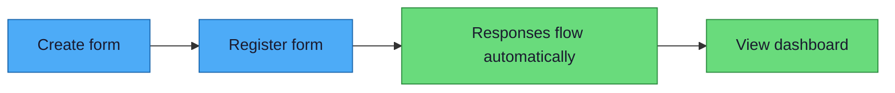
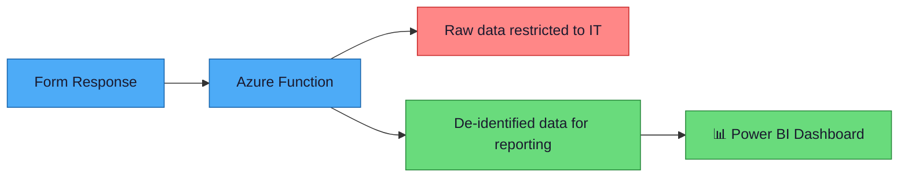

# Your Guide to Creating Forms & Viewing Results

## Welcome!

This system makes it easy for you to collect information using Microsoft Forms and see the results in clear, visual dashboards. You create a form, people fill it out, and the responses automatically appear in a dashboard you can view anytime. That's it!

---

## What You Need

You already have everything you need:

- **A Microsoft 365 account** — the same one you use for Outlook and Teams
- **Access to Microsoft Forms** — included with your Microsoft 365 account
- **A web browser** — Chrome, Edge, or Safari all work

No software to install. No special permissions to request.

---

## Step 1: Create Your Form

### Open Microsoft Forms

1. Go to [forms.microsoft.com](https://forms.microsoft.com) in your web browser
2. Sign in with your work email and password (the same ones you use for Outlook)

### Create a New Form

1. Click **"New Form"**
2. Give your form a name (for example, "Patient Intake Questionnaire" or "Staff Feedback Survey")
3. Add a short description if you'd like — this helps respondents understand the purpose

### Add Your Questions

1. Click **"Add new"** to add a question
2. Choose the type of question you want:
   - **Choice** — respondents pick from a list of options (great for yes/no or multiple choice)
   - **Text** — respondents type a short or long answer
   - **Rating** — respondents give a star rating (useful for satisfaction scores)
   - **Date** — respondents pick a date from a calendar
   - **Ranking** — respondents put items in order of preference
   - **Likert** — respondents rate multiple statements on a scale (for example, "Strongly Agree" to "Strongly Disagree")
3. Type your question
4. Add answer options if needed
5. Repeat for each question

### Tips for Great Forms

- ✅ **Use clear, simple question titles** — write questions the way you'd ask them out loud
- ✅ **Mark important questions as "Required"** — toggle the "Required" switch so respondents can't skip critical questions
- ✅ **Keep it short** — shorter forms get more responses
- ✅ **Use Choice questions when possible** — they're easier to analyze than free-text answers
- ✅ **Preview your form** — click the **"Preview"** button (eye icon) to see what respondents will see
- ✅ **Use consistent naming** — if you have multiple forms, use a clear naming pattern (for example, "Clinic A — Patient Feedback — 2024")

---

## Step 2: Register Your Form

Before your form data can appear in a dashboard, you need to register it. This is a quick, one-time step — just fill out a short form and you're done.

### What to Do

1. Open the **"Register Your Form for Analytics"** link provided by your IT or admin team. If you don't have it yet, ask them to share the registration form URL.
2. **Paste your form's share link** — in Microsoft Forms, click the **"Share"** button and copy the link
3. **Add a brief description** of what your form is for (optional, but helpful)
4. **Tell us if your form collects patient information** — things like names, dates of birth, or medical record numbers
5. Click **Submit**

That's it! No email required.

### What Happens Next

- **If your form does NOT collect patient info** → it's connected automatically! You'll get an email confirmation within seconds, and responses will start flowing to your dashboard right away.
- **If your form DOES collect patient info** → your organization's IT team will review it and set it up within **1–2 business days**. This extra step makes sure all sensitive data is properly protected. You'll get an email when it's ready.

---

## Step 3: Your Data Flows Automatically

Once your form is registered, you're all set. Here's what happens behind the scenes:

1. Someone fills out your form
2. Their response is automatically and securely sent to our analytics platform
3. Sensitive patient information is automatically protected
4. The response appears in your dashboard

**You don't need to do anything.** It just works.

### Your Journey at a Glance

---

## Step 4: View Your Results

### Open Power BI

1. Go to [app.powerbi.com](https://app.powerbi.com) in your web browser
2. Sign in with your work email and password

<!-- Screenshots for Power BI views will be added in a future update -->
`[Screenshot: Power BI home page]`

### Find Your Dashboard

1. Look in the left sidebar and click **"Workspaces"**
2. Find the workspace for your team or department
3. Click on the dashboard for your form

`[Screenshot: Workspaces list with example workspace highlighted]`

`[Screenshot: Dashboard inside a workspace]`

### What You'll See

Your dashboard shows your form's data in easy-to-read charts and tables:

- **Response count** — how many people have filled out your form
- **Trends over time** — a chart showing when responses came in (by day, week, or month)
- **Summary charts** — visual breakdowns of answers to each question
- **Individual responses** — a table with each response (with sensitive data protected)

You can filter the data by date, by specific answers, or by other criteria. Just click on the filter options at the top of the dashboard.

`[Screenshot: Example dashboard showing response count, trend chart, and summary]`

---

## What About Patient Privacy?

Patient privacy is a top priority. Here's how your data is protected:

- 🔒 **Sensitive fields are automatically protected** — any fields you identified as containing patient information (names, dates of birth, etc.) are automatically de-identified (made anonymous) before they reach the dashboard
- 🔒 **Only authorized people can see full data** — only people you and IT specifically approve can access the dashboard
- 🔒 **Data stays within your organization** — all data is stored securely on your organization's systems, never on external servers
- 🔒 **Access is logged** — the system keeps a record of who views the data

If you have concerns about patient privacy, please contact your organization's compliance team at **[compliance-email@organization.com]**.

### How Your Data Is Protected

---

## Common Questions

**Can I edit my form after it's registered?**
> Yes! You can update question text, add answer options, or change descriptions anytime. However, if you **add or remove entire questions**, please let IT know so we can update the dashboard to match.

**How quickly do responses show up in the dashboard?**
> Responses typically appear within **a few minutes** of being submitted.

**Who can see my form's data?**
> Only the people you and IT have authorized. No one else can access your dashboard.

**What if something looks wrong in the dashboard?**
> Contact your organization's support team right away at **[support-email@organization.com]** or call **[support-phone-number]**. They will investigate and resolve it.

**Can I download the data?**
> Yes — Power BI lets you export data to Excel. Ask IT if you need help with this.

**Can I use my form on a phone or tablet?**
> Yes! Microsoft Forms works on any device with a web browser. Respondents can fill out your form on their phone, tablet, or computer.

---

## Need Help?

Contact your organization's support team:

- 📧 **Email:** [support-email@organization.com]
- 📞 **Phone:** [support-phone-number]
- 💬 **Teams:** [support-Teams-channel-link]
- 🕐 **Hours:** Monday–Friday, [support-hours]

> *Replace the placeholder contact information above with your organization's actual support details.*

For urgent issues related to patient data, contact **[compliance-email@organization.com]** directly.
