# End-to-End Walkthrough: Forms to Fabric

> **Audience:** Clinicians, IT Administrators, Project Stakeholders
> **Last Updated:** 2026-03-25

This guide walks through the complete Forms-to-Fabric pipeline — from creating a Microsoft Form to seeing de-identified data in a Fabric Lakehouse. Every screenshot was captured automatically using Playwright with Microsoft Edge.

---

## Pipeline Overview

```mermaid
flowchart LR
    A["1. Create Form"] --> B["2. Share Link"]
    B --> C["3. Register Form"]
    C --> D{"PHI?"}
    D -- No --> F["5. Collect Responses"]
    D -- Yes --> E["4. Admin Approval"]
    E --> F
    F --> G["6. Data Flow Runs"]
    G --> H["7. Lakehouse Tables"]

    classDef primary fill:#4dabf7,stroke:#1864ab,color:#1a1a2e
    classDef success fill:#69db7c,stroke:#2b8a3e,color:#1a1a2e
    classDef warning fill:#ffd43b,stroke:#e67700,color:#1a1a2e
    classDef danger fill:#ff8787,stroke:#c92a2a,color:#1a1a2e
    classDef info fill:#b197fc,stroke:#6741d9,color:#1a1a2e
    classDef neutral fill:#ced4da,stroke:#495057,color:#1a1a2e

    A:::primary
    B:::primary
    C:::info
    D:::warning
    E:::danger
    F:::primary
    G:::info
    H:::success
```

**Roles involved:**
- **Clinician** — creates the form, registers it, collects responses
- **IT Admin** — approves PHI forms, monitors the pipeline

---

## 1. Create Your Form in Microsoft Forms

The clinician starts by navigating to [forms.office.com](https://forms.office.com) and signing in with their work account.

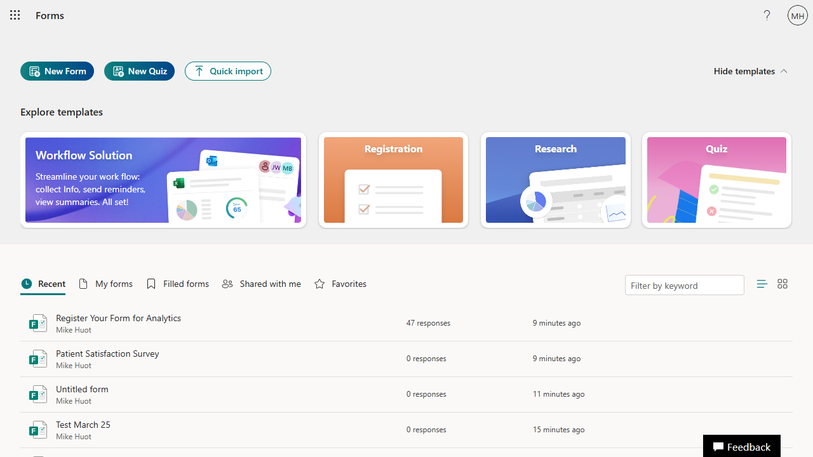

Click **"New Form"** to open the form builder. Add a descriptive title and optional description so respondents understand the form's purpose.

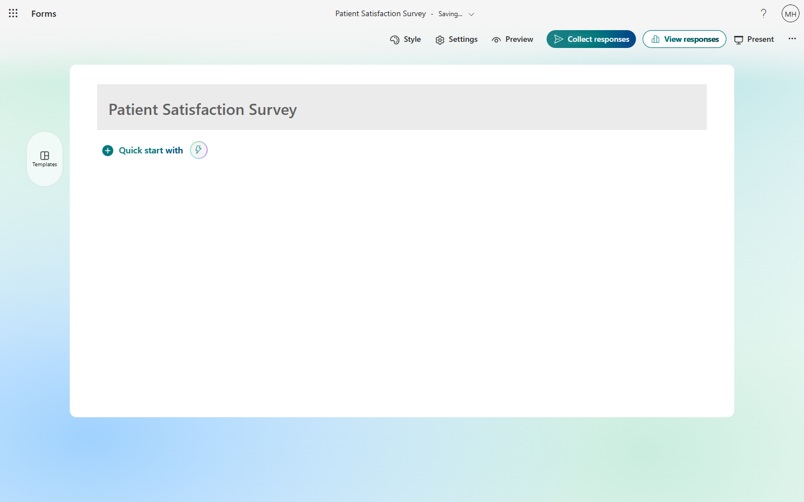

Add questions using the **"Add new"** button. Choose from question types like Choice, Text, Rating, and Date. Here we add a choice question for patient satisfaction:

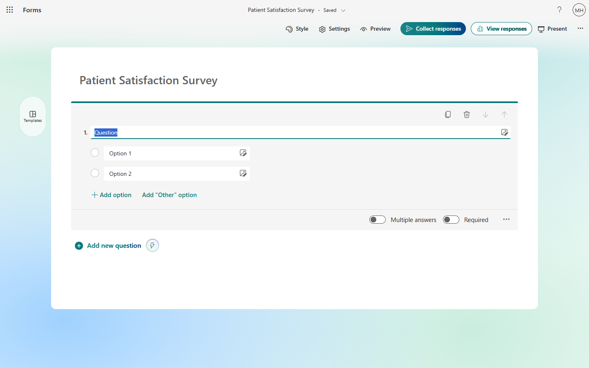

---

## 2. Share Your Form and Copy the Link

Once your form is ready, click the **Share** button to get the shareable link. You'll need this link for the registration step.

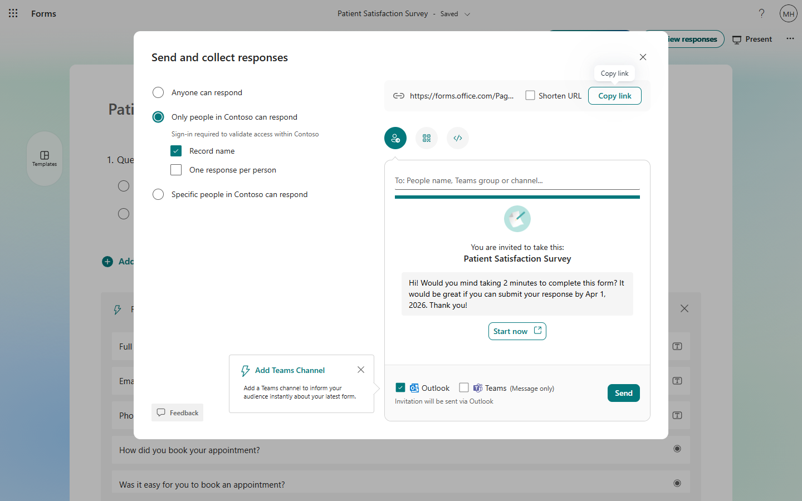

Copy the link — it will look something like `https://forms.office.com/Pages/ResponsePage.aspx?id=...`

---

## 3. Register Your Form for Analytics

Open the **"Register Your Form for Analytics"** form provided by your IT team. This is a quick, one-time step with 3 questions:

1. **Paste your form's share link** — the link you copied in step 2
2. **Give your form a short name** — e.g., "Patient Satisfaction Survey"
3. **Does this form collect patient information?** — Yes or No

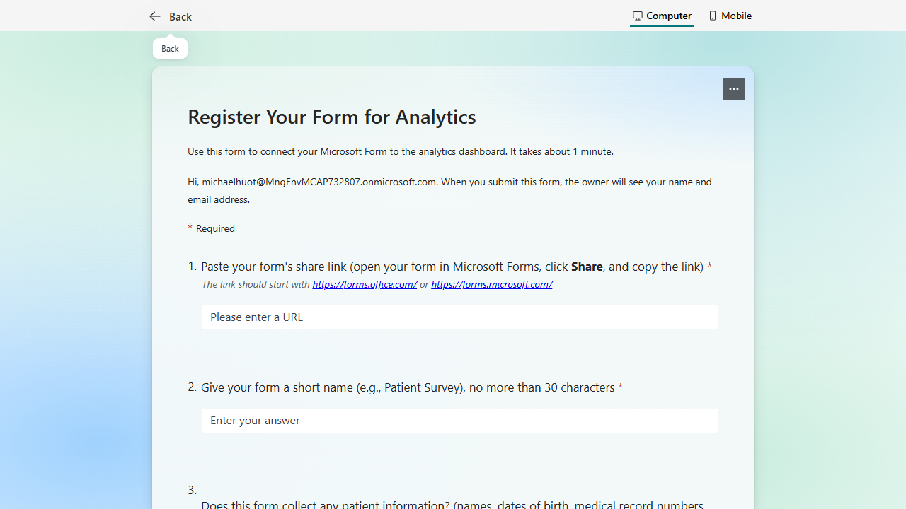

Fill in all three fields. In this walkthrough we select **"No"** for the PHI question, which means the form is activated automatically without admin review:

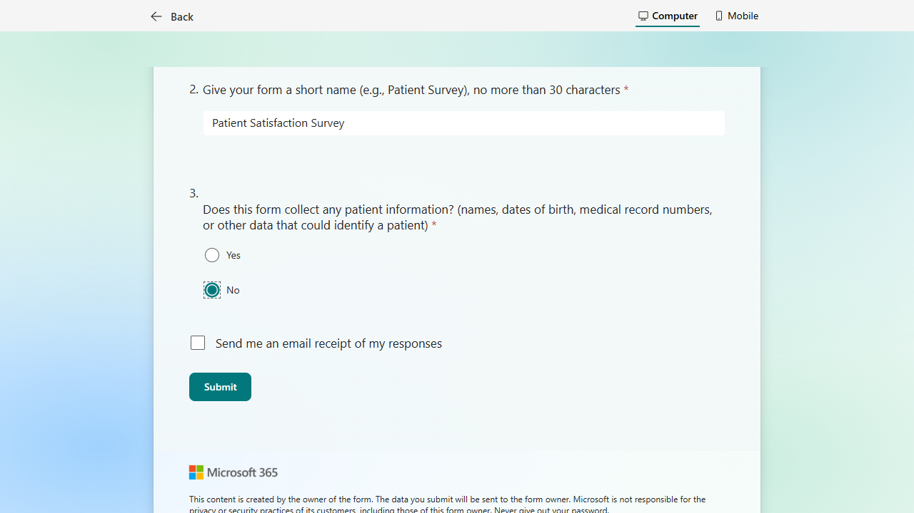

Click **Submit**. You'll see a confirmation message indicating next steps:

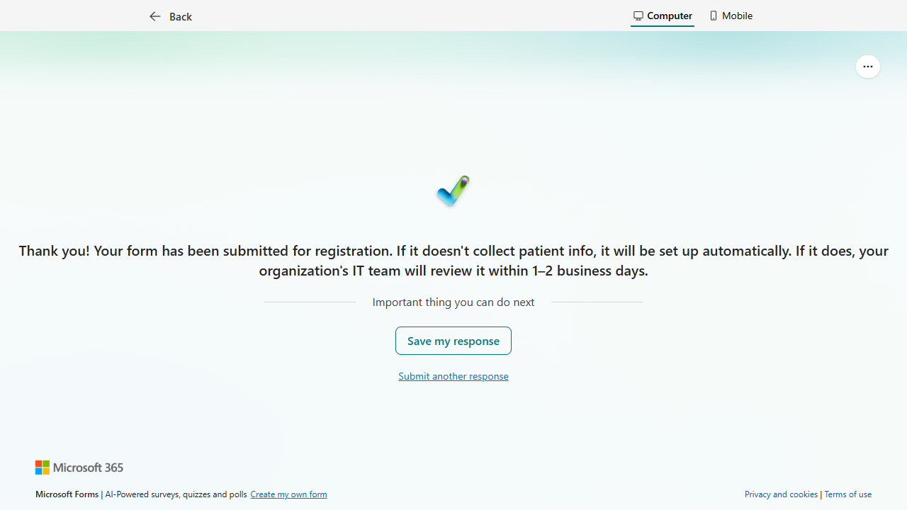

Behind the scenes, a Power Automate flow triggers and calls the Azure Function registration endpoint. The flow creates the per-form data pipeline automatically. Because this form does not collect PHI, it is activated immediately:

---

## 4. Admin Approval (PHI Forms Only)

> **Role:** IT Administrator

Forms that collect patient information (PHI = "Yes") require admin approval before data flows through the pipeline. Since we selected **"No"** in this walkthrough, this step is **skipped** — the form was activated automatically upon registration.

For PHI forms, the admin would review the form configuration, classify PHI fields, and activate it via the `POST /api/activate-form` endpoint:

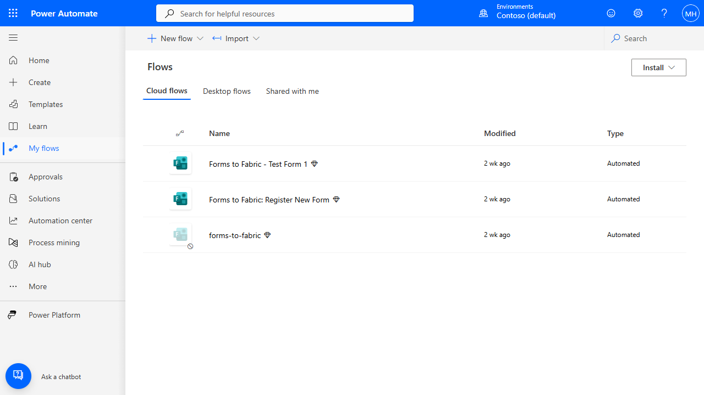

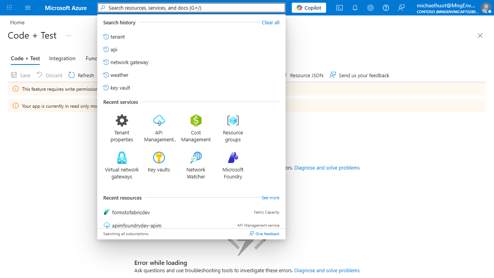

> **Non-PHI forms** (like this walkthrough) skip admin approval entirely — they are activated automatically upon registration.

---

## 5. Collect Responses

> **Role:** Clinician

With the form registered (and activated if PHI), share the form link with respondents. When someone opens the form and fills it out:

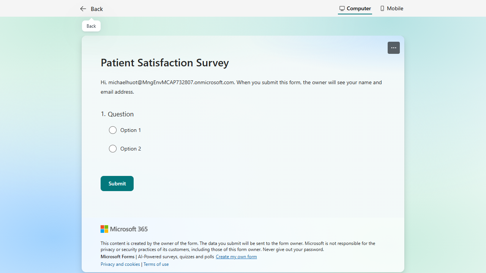

The respondent fills in their answers and clicks **Submit**:

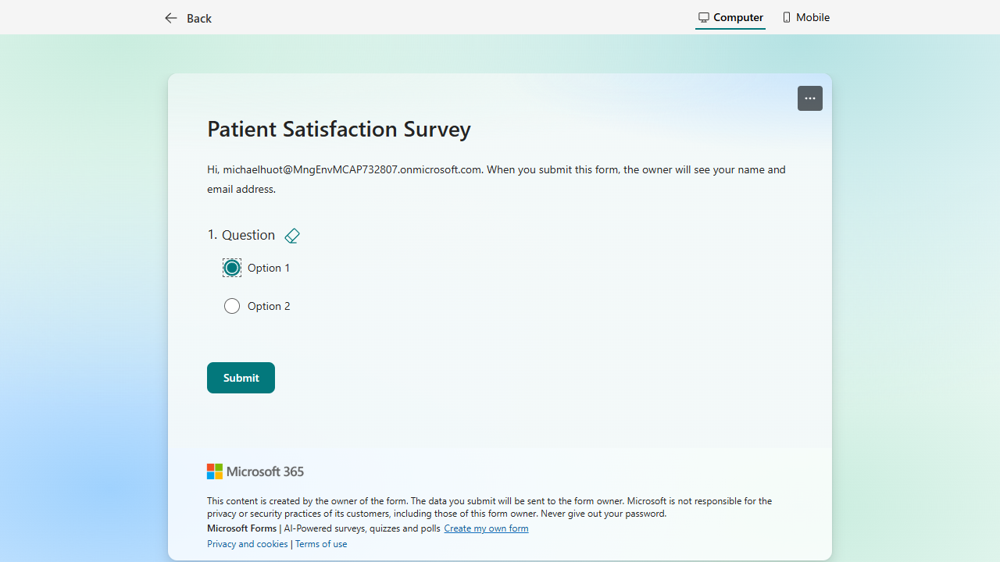

They see a confirmation that their response was recorded:

---

## 6. Data Flows Through the Pipeline

Each form submission automatically triggers the per-form Power Automate flow. The flow calls the Azure Function `POST /api/process-response` endpoint, which:

1. Validates the response against the form's registry entry
2. Applies de-identification (hash, redact, generalize) to PHI fields
3. Writes raw data to the restricted Lakehouse layer
4. Writes de-identified data to the curated Lakehouse layer

---

## 7. View Data in the Fabric Lakehouse

> **Role:** IT Administrator or authorized analyst

Navigate to [app.fabric.microsoft.com](https://app.fabric.microsoft.com) and open the **Forms to Fabric Analytics** workspace. The `forms_lakehouse` item is visible in the workspace:

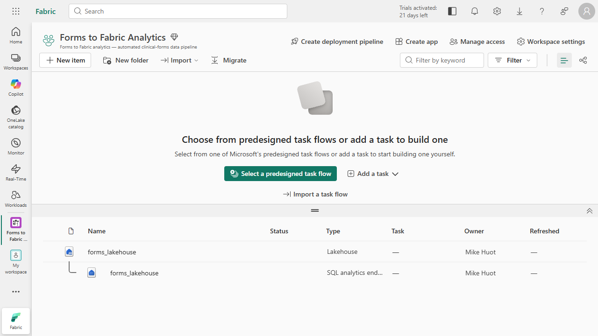

### Raw Table (Restricted Access)

The raw table contains the original, unmodified response data — including PHI fields. Access is restricted to authorized IT personnel only. Open the Lakehouse to see the Tables and Files sections:

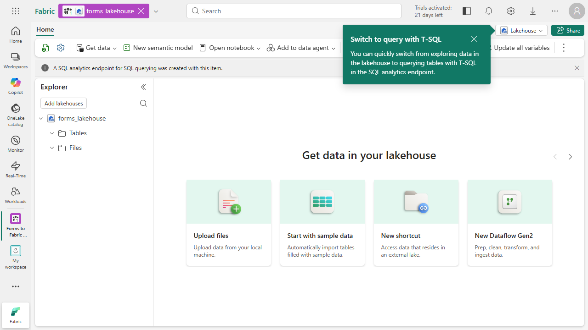

### Curated Table (De-identified)

The curated table contains de-identified data safe for reporting. PHI fields are hashed, redacted, or generalized according to the form's configuration. Tables populate as responses flow through the pipeline:

---

## Summary

| Step | Actor | What Happens |
|------|-------|--------------|
| 1. Create Form | Clinician | Builds a Microsoft Form with questions |
| 2. Share Link | Clinician | Copies the form's share link |
| 3. Register | Clinician | Submits the share link via the registration form |
| 4. Approve | IT Admin | Reviews and activates PHI forms (auto for non-PHI) |
| 5. Collect | Respondents | Fill out the form |
| 6. Process | Automated | Power Automate + Azure Function de-identify and ingest |
| 7. View | Analyst | Query raw or curated tables in Fabric Lakehouse |

---

## Related Documents

- [Clinician Guide](clinician-guide.md) — Step-by-step guide for form creators
- [Admin Guide](admin-guide.md) — Managing forms, approvals, and the registry
- [Architecture](architecture.md) — Technical system design
- [Registration Form Template](registration-form-template.md) — How IT creates the registration form
