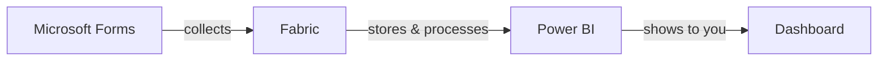
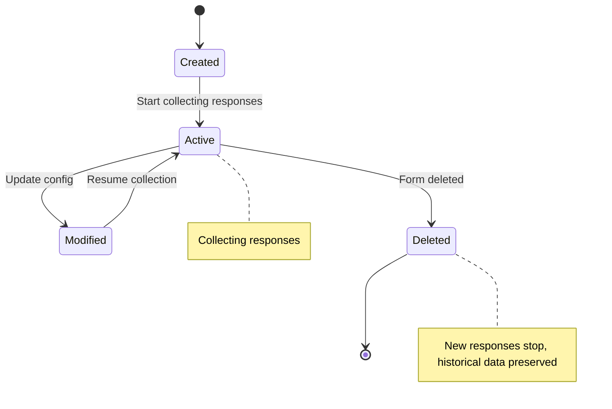

# Frequently Asked Questions

---

## For Clinicians

### Where does my form data go?

When someone fills out your Microsoft Form, their response is automatically sent to a secure analytics platform called Microsoft Fabric. From there, the data is displayed in a Power BI dashboard that you can view anytime. Think of it as: **Forms collects the data → Fabric stores and processes it → Power BI shows it to you.**



All of this happens automatically. You don't need to move or export any data yourself.

---

### Who can see my responses?

Only people who have been specifically authorized — that means you and anyone else you and IT have approved. No one outside your authorized list can see your form's data.

If you want to add or remove someone's access, contact your organization's IT team at **[your-it-support-email]**.

---

### Is patient information protected?

Yes, absolutely. When you register your form, you tell us which fields contain sensitive patient information (like names, dates of birth, or medical record numbers). The system automatically de-identifies that information — meaning it removes or masks those details so they can't be linked back to individual patients in the dashboard.

Only specifically authorized users with the right permissions can see the original, unmasked data.

---

### How quickly do responses appear in reports?

Responses typically show up in your Power BI dashboard within **a few minutes** of being submitted. If you notice a delay longer than 15 minutes, contact IT support.

---

### Can I change my form after it's set up?

Yes, you can make changes to your form anytime:

- **Small changes** (fixing a typo, updating a question's wording, reordering questions) — go ahead, no need to tell anyone
- **Bigger changes** (adding new questions, removing questions, changing question types) — please let IT know at **[your-it-support-email]** so we can update your dashboard to match

---

### What happens if I delete my form?

If you delete your form in Microsoft Forms:

- **New responses** will stop being collected (since the form no longer exists)
- **Past responses** that were already sent to the system are still safely stored and will still appear in your dashboard
- Your Power BI dashboard will remain available with the historical data

If you want to delete the dashboard and all stored data as well, contact IT to request a full removal.



---

### Can I use Forms on my phone or tablet?

Yes! Microsoft Forms works on any device with a web browser — phones, tablets, laptops, and desktops. This applies to both you (creating and editing forms) and your respondents (filling them out).

There's no app to install. Just open your browser and go to [forms.microsoft.com](https://forms.microsoft.com).

---

### How do I share my form with respondents?

1. Open your form in Microsoft Forms
2. Click the **"Share"** button (it looks like a paper airplane icon, in the top right)
3. Choose how you want to share:
   - **Copy the link** and paste it into an email, Teams message, or document
   - **Generate a QR code** that people can scan with their phone camera
   - **Embed it** in a website or Teams channel
4. You can also choose who can respond:
   - "Anyone with the link" — open to everyone
   - "Only people in my organization" — restricted to colleagues with a company account

---

### What types of questions can I use?

Microsoft Forms offers several question types:

| Question Type | Best For | Example |
|---|---|---|
| **Choice** | Yes/no, multiple choice, dropdowns | "What is your department?" |
| **Text** | Short or long written answers | "Please describe your symptoms" |
| **Rating** | Star ratings (1–5 or 1–10) | "Rate your experience" |
| **Date** | Picking a specific date | "Date of visit" |
| **Ranking** | Putting items in order | "Rank these priorities" |
| **Likert** | Agreement scales for multiple statements | "Rate each statement from Strongly Disagree to Strongly Agree" |
| **Net Promoter Score** | How likely someone is to recommend (0–10) | "How likely are you to recommend this service?" |

**Tip:** Use Choice questions whenever possible — they're much easier to analyze in dashboards than free-text answers.

---

### Can multiple people manage the same form?

Yes! You can add collaborators to your form:

1. Open your form in Microsoft Forms
2. Click the **three dots (⋯)** menu in the top right
3. Select **"Collaborate or Duplicate"**
4. Share the collaboration link with your colleagues

Collaborators can edit questions, view responses, and manage the form just like you can.

---

### How do I register my form?

Go to the **[registration form link placeholder]** and fill out the short registration form. You'll need to paste your form's share link, add a brief description, and tell us whether your form collects patient information. That's it — just three questions, and you're done!

---

### How long does registration take?

It depends on whether your form collects patient information:

- **No patient info** → your form is connected **instantly**. You'll get an email confirmation right away, and responses will start appearing in your dashboard within minutes.
- **Has patient info** → your organization's IT team will review it and set it up within **1–2 business days**. You'll get an email when it's ready.

---

### What if I forgot to say my form has patient info?

No worries — just contact your organization's IT team at **[your-it-support-email]** and let them know. They can update the settings and make sure your patient data is properly protected. It's a quick fix on their end.

---

---

## For Administrators

### How do I register a new form?

To connect a new Microsoft Form to the pipeline:

1. Get the **form URL** from the clinician (they can find it by clicking "Share" in Microsoft Forms)
2. Identify which **fields contain sensitive patient information** (the clinician should tell you this)
3. Follow the registration process documented in the [admin guide](admin-guide.md)
4. Configure the data flow and de-identification rules
5. Set up the Power BI dashboard or add the form's data to an existing dashboard
6. Confirm the **access permissions** — who should be able to view the dashboard
7. Notify the clinician that their form is ready

Typical turnaround time: **1–2 business days**.

---

### How do I configure de-identification rules?

De-identification rules determine which fields are masked or removed before data reaches the dashboard. To configure them:

1. Review the list of sensitive fields provided by the clinician
2. Open the pipeline configuration (see the [admin guide](admin-guide.md) for details)
3. Map each sensitive field to a de-identification method:
   - **Masking** — replaces values with asterisks or generic text (e.g., "Jane Doe" → "****")
   - **Hashing** — converts values to anonymous codes that can still be used for counting unique entries
   - **Removal** — completely removes the field from the dashboard data
4. Test the configuration by submitting a test response and verifying the dashboard shows the de-identified data
5. Document which rules were applied for compliance records

---

### What happens when a form's structure changes?

When a clinician adds, removes, or changes questions in their form:

- **Added questions** — new fields will start appearing in the raw data but won't automatically show up in the dashboard. You'll need to update the dashboard to include them.
- **Removed questions** — the field will stop receiving new data. Historical data for that question is preserved.
- **Renamed questions** — the system may treat the renamed question as a new field. Check the pipeline to make sure data is still mapping correctly.
- **Changed question types** — (for example, from Text to Choice) may cause data type mismatches. Review and update the pipeline configuration.

**Best practice:** Ask clinicians to notify you before making structural changes so you can plan any needed updates.

---

### How do I grant someone access to the Power BI dashboard?

1. Open [app.powerbi.com](https://app.powerbi.com)
2. Navigate to the workspace containing the dashboard
3. Click **"Access"** in the workspace settings
4. Add the person's email address
5. Choose the appropriate role:
   - **Viewer** — can see dashboards and reports but can't edit
   - **Contributor** — can edit reports and dashboards
   - **Admin** — full control over the workspace
6. Click **"Add"**

For dashboards with sensitive data, always follow the principle of least privilege — give people the minimum level of access they need.

---

### How do I troubleshoot if data isn't flowing?

If responses aren't appearing in the Power BI dashboard, check these in order:

1. **Is the form still active?** — Open the form URL and confirm it's accepting responses
2. **Check the pipeline status** — Look at the pipeline monitoring in Microsoft Fabric to see if there are errors or if the pipeline has stopped
3. **Review the connector** — Confirm the connection between Microsoft Forms and the pipeline is still active and authenticated
4. **Check for data format issues** — If the clinician recently changed the form structure, the pipeline may be failing due to unexpected data formats
5. **Review logs** — Check the pipeline logs for specific error messages
6. **Test with a new response** — Submit a test response and trace it through each step of the pipeline

If you can't resolve the issue, refer to the [admin guide](admin-guide.md) or contact your organization's platform engineering team at **[your-engineering-email]**.

---

### What are the system requirements?

**For clinicians (form creators and dashboard viewers):**
- A Microsoft 365 account with access to Microsoft Forms
- A modern web browser (Edge, Chrome, Safari, or Firefox)
- Power BI access (included with most Microsoft 365 enterprise licenses)

**For the pipeline infrastructure:**
- Microsoft Fabric capacity (see the [setup guide](setup-guide.md) for details)
- Power Automate premium connectors (for the Forms to Fabric data flow)
- Appropriate Microsoft Entra ID (formerly Azure Active Directory) permissions for service accounts

---

### How is the data secured?

The system uses multiple layers of security:

- **Encryption in transit** — all data is encrypted as it moves between Forms, the pipeline, and Power BI (using TLS 1.2 or higher)
- **Encryption at rest** — all stored data is encrypted on Microsoft's servers
- **Access controls** — Power BI workspaces use role-based access, so only authorized users can view data
- **De-identification** — sensitive patient information is automatically de-identified before it reaches dashboards
- **Audit logging** — all access to data is logged for compliance and auditing purposes
- **Data residency** — all data remains within the organization's Microsoft 365 tenant and configured geographic region

For full security documentation, refer to the [architecture documentation](architecture.md).

---

### Is there a tool to manage form registrations without editing JSON?

Yes! The `manage_registry.py` CLI tool provides validated commands for adding forms, adding fields, and checking your configuration:

```bash
# Add a new form
python scripts/manage_registry.py add-form --form-id "my-form-id" --form-name "My Survey" --target-table "my_survey"

# Add a field with PHI protection
python scripts/manage_registry.py add-field --form-id "my-form-id" --question-id "q1" --field-name "patient_name" --contains-phi --deid-method "redact"

# Validate the entire registry
python scripts/manage_registry.py validate

# List all registered forms
python scripts/manage_registry.py list
```

This prevents JSON syntax errors and catches configuration mistakes before deployment.

---

### How do I quickly set up a Power Automate flow for a new form?

Use the flow generator endpoint instead of building flows manually:

1. Call: `GET https://<function-app>/api/generate-flow?form_id=<your-form-id>`
2. Save the returned JSON as a `.json` file
3. In Power Automate, go to **My flows** → **Import** → upload the file
4. Configure your Forms and Key Vault connections
5. Save and enable the flow

This reduces setup from ~15 minutes to ~2 minutes and eliminates common configuration errors.

---

### How does self-service registration work?

When a clinician fills out the registration form, a Power Automate flow picks up the submission and calls the `POST /api/register-form` endpoint on the Azure Function. The endpoint creates a new entry in `form-registry.json` and returns a status:

- **Non-PHI forms** are activated immediately (`status: active`). The clinician receives an email confirmation, and a response-processing flow can be generated right away.
- **PHI forms** are set to `status: pending_review`. IT receives a Teams adaptive card notification with the form details. An admin must review the form, classify PHI fields using `manage_registry.py add-field`, and call `POST /api/activate-form` (or use the CLI) to activate it. The clinician is notified by email once activation is complete.

See [docs/registration-form-template.md](registration-form-template.md) for the registration form setup and `power-automate/registration-flow-template.json` for the flow reference.

---

### What happens to new fields added after a form is registered?

New fields are captured in the **raw layer** of the Lakehouse but are **excluded from the curated layer** until they are classified. This means the data is safely stored but won't appear in dashboards or reports until an admin adds the field configuration using `manage_registry.py add-field`. The schema monitor function runs every 6 hours and will alert IT when unregistered fields are detected.

---

### What happens if a clinician changes their form without telling IT?

The system automatically detects form changes. A scheduled function runs every 6 hours and compares each registered form's current structure against the pipeline configuration. If questions have been added, removed, or renamed, IT is alerted via Application Insights (and optionally by email).

This prevents silent data loss that would otherwise occur if new questions aren't captured by the pipeline.

---

### How are function keys rotated without breaking the pipeline?

Use the automated key rotation script:

```bash
python scripts/rotate_function_key.py --function-app <name> --resource-group <rg> --key-vault <vault>
```

This generates a new key, stores it in Key Vault, and all Power Automate flows using the Key Vault–integrated template automatically pick up the new key. No manual flow updates are needed.
