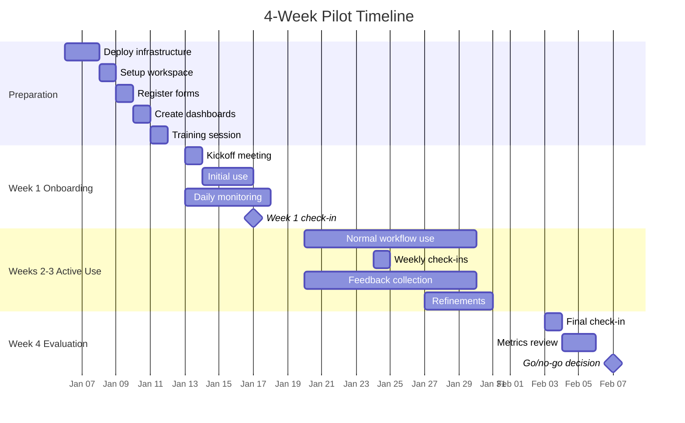
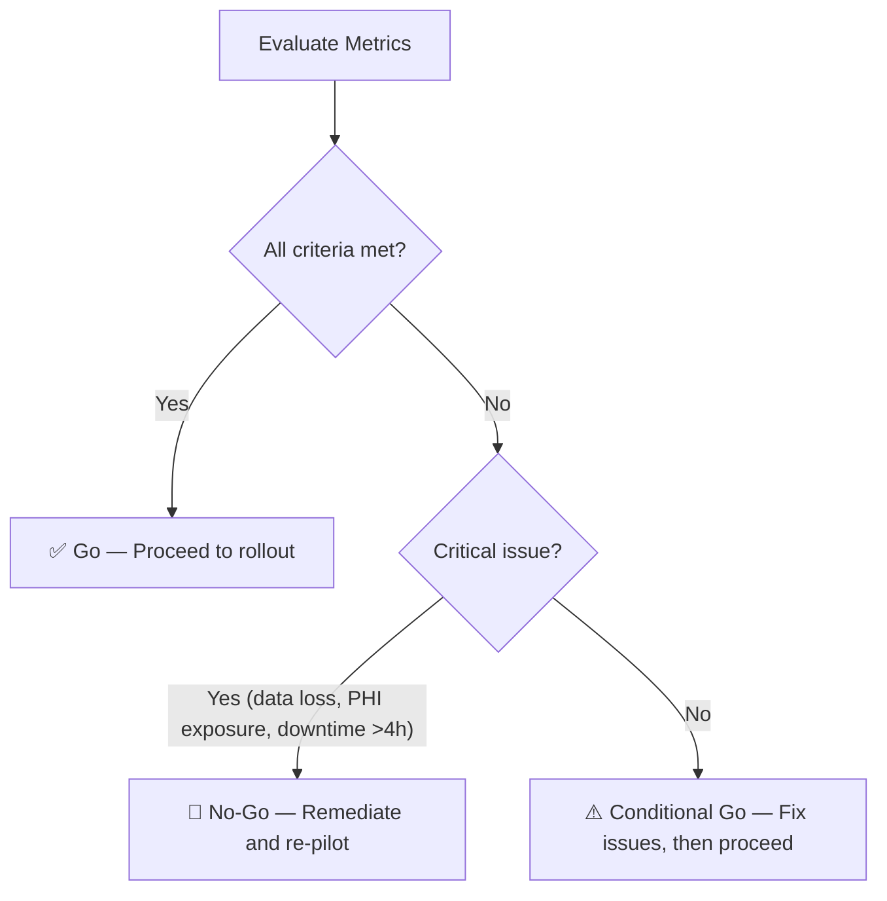

# Forms to Fabric — Pilot Program Plan

## Objectives

- Validate the end-to-end pipeline in a real clinical environment
- Gather clinician feedback on workflow and usability
- Confirm data accuracy and de-identification effectiveness
- Measure pipeline reliability and performance
- Identify issues before broader rollout
- Build internal champions for the platform

## Pilot Scope

- **Participants**: 2–3 clinicians from 1 department (suggest: a department already comfortable with Microsoft Forms)
- **Forms**: 1–2 existing or new clinical forms (e.g., patient satisfaction survey, pre-visit questionnaire)
- **Duration**: 4 weeks
- **Data volume**: Estimate 10–50 responses per form per week

## Selection Criteria for Pilot Participants

- Comfortable with Microsoft Forms (existing user preferred)
- Willing to provide regular feedback
- Department with non-critical data initially (to reduce risk)
- Clinician with some analytical interest (will appreciate the dashboards)
- Manager support for participation
- Existing forms that can be registered (reduces setup effort)

## Timeline

### Week 0: Preparation (Before Pilot Start)

- Deploy infrastructure (`azd up`)
- Set up Fabric workspace and Lakehouse
- Create Power Automate flow
- Register pilot forms in form-registry.json
- Configure de-identification rules with department input
- Create initial Power BI dashboard
- Conduct training session with pilot participants

### Week 1: Onboarding and Initial Use

- Pilot kickoff meeting
- Clinicians begin using forms for real data collection
- IT monitors pipeline closely (daily log review)
- Address any immediate issues
- First check-in (end of week)

### Weeks 2–3: Active Use

- Clinicians use forms as part of normal workflow
- Data accumulates in Lakehouse and dashboards
- Weekly check-in meetings (15 min)
- Collect feedback on usability and data quality
- IT monitors for edge cases and errors
- Refine de-identification rules if needed
- Capture any schema changes clinicians make

### Week 4: Evaluation

- Final check-in and feedback session
- Review all success metrics (see table below)
- Document lessons learned
- Go/no-go decision for broader rollout
- Plan for next phase

## Success Metrics

| Metric | Target | Measurement Method |
|--------|--------|--------------------|
| Pipeline latency | < 5 minutes end-to-end | Application Insights timestamps |
| Data accuracy | 100% of responses captured correctly | Compare Forms responses vs Lakehouse data |
| De-identification effectiveness | 100% of PHI fields properly de-identified | Manual audit of curated layer (sample 20 records) |
| Zero data loss | 0 responses lost | Compare Forms response count vs Lakehouse row count |
| Pipeline uptime | > 99% during pilot period | Application Insights availability |
| User satisfaction | ≥ 4/5 average rating | Post-pilot survey |
| Dashboard usability | Clinicians can independently read dashboard | Observation during check-ins |
| Error rate | < 2% of submissions trigger errors | Power Automate flow run history |

## Feedback Collection

### Weekly Check-ins (15 minutes)

- What's working well?
- What's frustrating or confusing?
- Any data quality issues noticed?
- Any feature requests?
- Blockers or concerns?

### Feedback Form

- Distributed at end of Week 2 and Week 4
- Likert scale questions (1–5) on ease of use, data trust, dashboard usefulness
- Open-ended questions for suggestions
- Use Microsoft Forms for meta-irony (collecting feedback on the feedback system using the system itself)

### IT Observation

- Pipeline health metrics
- Error patterns
- Schema change frequency
- Support ticket analysis

## Go/No-Go Criteria for Broader Rollout

### Go Criteria (all must be met)

- [ ] All success metrics at or above target
- [ ] No unresolved critical issues
- [ ] Clinician feedback average ≥ 4/5
- [ ] De-identification audit passed with zero PHI leaks
- [ ] Pipeline handled peak load without issues
- [ ] Documentation updated based on pilot learnings

### No-Go Triggers (any one blocks rollout)

- Data loss incident during pilot
- PHI exposure in curated layer
- Pipeline downtime > 4 hours
- Clinician satisfaction < 3/5
- Unresolved security concern
- Compliance issue identified

### Conditional Go (proceed with modifications)

- Minor usability issues → address before rollout
- Performance below target but functional → optimize and re-test
- Schema change handling needs improvement → enhance before scaling

## Risk Mitigation During Pilot

| Risk | Likelihood | Impact | Mitigation |
|------|-----------|--------|------------|
| Clinician modifies form structure mid-pilot | High | Medium | Document process for schema updates; monitor for changes |
| Pipeline failure during data collection | Low | High | Manual backup process; IT on-call during pilot |
| PHI appears in curated layer | Low | Critical | Pre-launch de-id audit; automated scanning; immediate response plan |
| Low adoption / clinician disengagement | Medium | High | Regular check-ins; visible value through dashboards; manager support |
| Fabric capacity constraints | Low | Medium | Monitor CU usage; have capacity upgrade plan ready |
| Power Automate throttling | Low | Low | Monitor flow runs; design for retry logic |

## Communication Plan

### Stakeholders

- **Pilot clinicians**: Weekly check-ins, direct Teams channel
- **Department manager**: Weekly summary email
- **IT leadership**: Bi-weekly status report
- **Compliance/Privacy**: Pre-launch review, post-pilot audit report
- **Project sponsor**: Week 0 and Week 4 briefings

### Communication Channels

- Dedicated Teams channel for pilot participants and IT support
- Email for formal status reports
- SharePoint for shared documents and guides

### Key Communications

| When | What | Who | Channel |
|------|------|-----|---------|
| Week 0 | Pilot kickoff announcement | All stakeholders | Email |
| Week 0 | Training session | Pilot clinicians | Teams meeting |
| Weekly | Check-in | Pilot clinicians + IT | Teams meeting |
| Weekly | Status summary | Department manager | Email |
| Bi-weekly | Status report | IT leadership | Email |
| Week 4 | Results presentation | All stakeholders | Teams meeting |
| Week 4 | Go/no-go recommendation | IT leadership + sponsor | Meeting |

## Post-Pilot Actions

### If Go

1. Document all learnings and update documentation
2. Create department onboarding checklist (see `docs/rollout-checklist.md`)
3. Plan Phase 2: onboard 2–3 additional departments
4. Scale infrastructure as needed
5. Establish ongoing support model

### If No-Go

1. Document all issues and root causes
2. Create remediation plan with timeline
3. Schedule re-pilot after fixes
4. Communicate transparently with stakeholders
