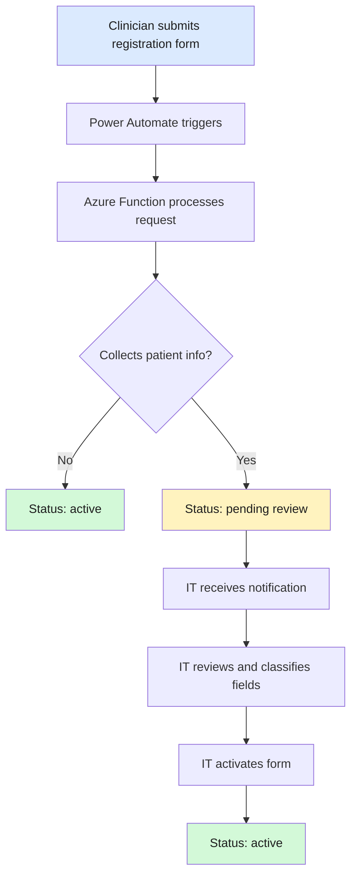

# Registration Form Template — "Register Your Form for Analytics"

> **Audience:** IT Administrators
> **Last Updated:** 2026-03-05


---

## Overview

Clinicians across the organization author data-collection forms in Microsoft Forms. Before those forms can feed into the analytics pipeline, they must be **registered** — a lightweight process that tells the system *which* form to watch, *what* it does, and *whether* it contains patient information.

The **"Register Your Form for Analytics"** Microsoft Form is a **meta-form**: a form about forms. A clinician fills it out once per data-collection form they want connected to the Fabric Lakehouse and Power BI dashboards. Submissions trigger a Power Automate flow that calls the Azure Function registration endpoint, which either activates the form automatically (no PHI) or places it in a pending-review queue (PHI).

> **Why a Microsoft Form?** Clinicians already know how to use Forms, no new tool adoption is needed, and Power Automate can trigger directly on submissions. See [Decisions Log — D-011](decisions.md#d-011) for alternatives considered.

---

## Questions to Create

Open [Microsoft Forms](https://forms.office.com) and create a new form with the three questions below. Match the question text, type, and settings exactly.

| # | Question Text | Type | Required | Notes |
|---|---------------|------|----------|-------|
| 1 | Paste your form's share link (open your form in Microsoft Forms, click **Share**, and copy the link) | Text (short answer) | Yes | See validation guidance below |
| 2 | Briefly describe what this form is for | Text (long answer) | No | Helps IT understand context when reviewing |
| 3 | Does this form collect any patient information? (names, dates of birth, medical record numbers, or other data that could identify a patient) | Choice: **Yes** / **No** | Yes | Determines whether the form requires IT approval before activation |

### Question 1 — Link Validation

Microsoft Forms does not support regex validation natively, but you can add a **restriction** to help catch obvious errors:

1. Click the question, then click the **…** menu → **Restrictions**.
2. Choose **URL** as the restriction type if available, otherwise leave as plain text.
3. In the subtitle / helper text, add: *"The link should start with `https://forms.office.com/` or `https://forms.microsoft.com/`."*

The Azure Function performs server-side validation and will reject malformed links with a clear error returned to the Power Automate flow.

---

## Form Settings

Configure the form with the following settings:

| Setting | Value |
|---------|-------|
| **Title** | Register Your Form for Analytics |
| **Description** | Use this form to connect your Microsoft Form to the analytics dashboard. It takes about 1 minute. |
| **Who can fill it out** | Only people in my organization |
| **Accept responses** | On |
| **Customize thank you message** | See below |

### Thank You Message

In the form settings, enable **Customize thank you message** and paste:

> Thank you! Your form has been submitted for registration. If it doesn't collect patient info, it will be set up automatically. If it does, your organization's IT team will review it within 1–2 business days.

### Additional Settings

- **Record name** — Enabled (so you can see who submitted each registration).
- **Response receipts** — Optional but recommended so the clinician has a copy.
- **One response per person** — Off (a clinician may register multiple forms).

---

## After Creating the Form

Once the form is saved in Microsoft Forms, complete these steps to connect it to the pipeline.

### Step 1 — Note the Form ID

1. Open the registration form in the Forms editor.
2. Look at the browser URL — it contains an `id=` parameter:
   ```
   https://forms.office.com/Pages/DesignPageV2.aspx?...&id=ePzQbQgk1kOiVUOD-9o_dsPlwRCEj...
   ```
3. Copy the value after `id=` (it's a long base64 string, not a short GUID). This is the form ID you will select in the Power Automate trigger.

### Step 2 — Create the Power Automate Flow

First, run the helper script to get your exact HTTP action values:

```powershell
pwsh scripts/Generate-FlowBody.ps1 -Registration
```

This outputs the URI, headers (including your function key), and body — ready to copy-paste.

Then build the flow:

1. Go to [flow.microsoft.com](https://flow.microsoft.com) → **+ Create** → **Automated cloud flow**
2. Name it: "Forms to Fabric — Registration Intake"
3. Trigger: **When a new response is submitted** → select "Register Your Form for Analytics"
4. **+ New step** → **Get response details** → same form, Response Id from trigger
5. **+ New step** → **HTTP** — paste the Method, URI, and Headers from the script output
6. For the **Body**, type this skeleton then use **Dynamic content** (⚡) to fill each value:

```
{
  "form_url": "",
  "description": "",
  "has_phi": ""
}
```

- Click inside `"form_url"` quotes → Dynamic content → select **"Paste your form's share link"**
- Click inside `"description"` quotes → Dynamic content → select **"Briefly describe..."**
- Click inside `"has_phi"` quotes → Dynamic content → select **"Does this form collect..."**

7. **+ New step** → **Condition** → `Status code` is not equal to `200`
   - **If yes**: Send error email to admin
   - **If no**: Leave empty
8. Save and enable

> **Tip:** The Function App URL and key are from `Post-Deploy.ps1` output (Step 3 of the setup guide). The function key is also stored in Key Vault.

### Step 3 — Test End-to-End

1. Open the registration form and submit a test entry with a known form link, a description, and **No** for patient info.
2. Verify the Power Automate flow runs successfully (check **Flow run history**).
3. Confirm the form appears in `config/form-registry.json` with `status: "active"`.
4. Repeat with **Yes** for patient info and verify the form appears with `status: "pending_review"`.

---

## What Happens After Submission



### Flow Details

| Step | Actor | What Happens |
|------|-------|--------------|
| 1 | Clinician | Fills out the registration form with their form link, description, and PHI flag |
| 2 | Power Automate | Triggers automatically on new submission; calls the Azure Function |
| 3 | Azure Function | Validates the link, extracts the form ID, creates a registry entry |
| 4a | System (no PHI) | Sets status to `active`; the form's responses will start flowing into the pipeline |
| 4b | System (PHI) | Sets status to `pending_review`; sends a notification email to the IT team |
| 5 | IT Admin | Reviews the form, classifies PHI fields, and activates via `manage_registry.py` |
| 6 | System | Once activated, responses flow into the raw (restricted) layer; PHI fields are excluded from the curated (de-identified) layer |

> **Note:** If a registered form's structure changes later, the Schema Monitor function detects the change, notifies IT, and quarantines new fields in the raw layer only until reviewed. See [Architecture — Schema Monitor](architecture.md) and [Decisions Log — D-014](decisions.md#d-014).

---

## Related Documents

- [Architecture](architecture.md) — Full system design
- [Setup Guide](setup-guide.md) — Azure Function and Power Automate deployment
- [Admin Guide](admin-guide.md) — Managing the form registry
- [Clinician Guide](clinician-guide.md) — End-user instructions
- [Decisions Log](decisions.md) — Why we chose this approach
