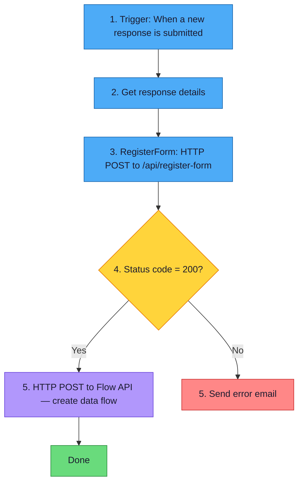
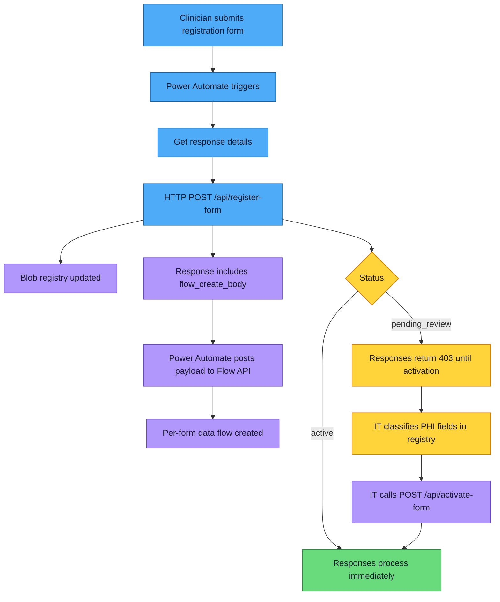

# Registration Form Template — "Register Your Form for Analytics"

> **Audience:** IT Administrators
> **Last Updated:** 2026-03-08


---

## Overview

Clinicians across the organization author data-collection forms in Microsoft Forms. Before those forms can feed into the analytics pipeline, they must be **registered** — a lightweight process that tells the system *which* form to watch, *what* it does, and *whether* it contains patient information.

The **"Register Your Form for Analytics"** Microsoft Form is a **meta-form**: a form about forms. A clinician fills it out once per data-collection form they want connected to the Fabric Lakehouse and Power BI dashboards. Submissions trigger a Power Automate flow that calls the Azure Function registration endpoint, which either activates the form automatically (no PHI) or places it in a pending-review queue (PHI).

> **Why a Microsoft Form?** Clinicians already know how to use Forms, no new tool adoption is needed, and Power Automate can trigger directly on submissions. See [Decisions Log — D-011](decisions.md#d-011) for alternatives considered.

---

## Questions to Create

Open [Microsoft Forms](https://forms.office.com) and create a new form with the three questions below. Match the question text, type, and settings exactly.

| # | Question Text | Type | Required | Notes |
|---|---------------|------|----------|-------|
| 1 | Paste your form's share link (open your form in Microsoft Forms, click **Share**, and copy the link) | Text (short answer) | Yes | See validation guidance below |
| 2 | Give your form a short name (e.g., Patient Intake Survey) | Text (short answer) | Yes | Used as the display name for the data pipeline and dashboard |
| 3 | Does this form collect any patient information? (names, dates of birth, medical record numbers, or other data that could identify a patient) | Choice: **Yes** / **No** | Yes | Determines whether the form requires IT approval before activation |

### Question 1 — Link Validation

Microsoft Forms does not support regex validation natively, but you can add a **restriction** to help catch obvious errors:

1. Click the question, then click the **…** menu → **Restrictions**.
2. Choose **URL** as the restriction type if available, otherwise leave as plain text.
3. In the subtitle / helper text, add: *"The link should start with `https://forms.office.com/` or `https://forms.microsoft.com/`."*

The Azure Function performs server-side validation and will reject malformed links with a clear error returned to the Power Automate flow.

> ⚠️ **Important:** The Azure Function extracts fields from the raw response **by position** (1st field = form URL, 2nd = description, 3rd = patient info). Do not reorder the questions in the form — the registration will fail if the order changes.

---

## Form Settings

Configure the form with the following settings:

| Setting | Value |
|---------|-------|
| **Title** | Register Your Form for Analytics |
| **Description** | Use this form to connect your Microsoft Form to the analytics dashboard. It takes about 1 minute. |
| **Who can fill it out** | Only people in my organization |
| **Accept responses** | On |
| **Customize thank you message** | See below |

### Thank You Message

In the form settings, enable **Customize thank you message** and paste:

> Thank you! Your form has been submitted for registration. If it doesn't collect patient info, it will be set up automatically. If it does, your organization's IT team will review it within 1–2 business days.

### Additional Settings

- **Record name** — Enabled (so you can see who submitted each registration).
- **Response receipts** — Optional but recommended so the clinician has a copy.
- **One response per person** — Off (a clinician may register multiple forms).

---

## After Creating the Form

Once the form is saved in Microsoft Forms, connect it to the pipeline.

> **Using a service account?** If you followed [Service Account Guide](service-account-guide.md) Step 2, **stop here and return to the SA guide** for Steps 3–4 (connections and flow creation). The steps below are the non-SA path.

### Step 1 — Copy the Form URL

1. Open the registration form in the Forms editor.
2. Copy the full URL from the browser address bar — you'll paste this when running `Create-RegistrationFlow.ps1`. The script extracts the form ID automatically.
   ```
   https://forms.office.com/Pages/DesignPageV2.aspx?...&id=ePzQbQgk1kOiVUOD-9o_dsPlwRCEj...
   ```

### Step 2 — Create the Power Automate Flow

The registration flow is simple — 5 core steps plus an error email branch. The Azure Function registers the form and returns the `flow_create_body` payload, and the Power Automate flow uses that payload to create the per-form data pipeline flow.

> Before clinicians use the registration form, set `FUNCTION_APP_KEY`, `FORMS_CONNECTION_NAME`, `OUTLOOK_CONNECTION_NAME`, and `ALERT_EMAIL` on the Function App. The generated per-form flows embed those values when `flow_create_body` is created. See [Setup Guide](setup-guide.md#31-configure-app-settings-for-auto-created-flows) and [Service Account Guide](service-account-guide.md).

#### Recommended: Create the flow with the script

```powershell
pwsh scripts/Create-RegistrationFlow.ps1
```

The script auto-detects your Function App URL, function key, tenant ID, and admin email. It prompts for the registration form ID (paste the URL from step 1), shows a configuration summary, and creates the flow via the Flow Management API.

Use `-DryRun` to preview the flow definition without creating it.



<details>
<summary>Manual alternative (if programmatic creation is not available)</summary>

**Footnotes — configuration values:**

Run `pwsh scripts/Generate-FlowBody.ps1 -Registration` to get values for footnotes 2–3.

| # | Field | Value |
|---|-------|-------|
| 1 | **Trigger Form** | Select "Register Your Form for Analytics" from the dropdown |
| 2 | **RegisterForm URI** | Copy from script output (e.g., `https://func-forms-dev-ec4zls.azurewebsites.net/api/register-form`) |
| 3 | **x-functions-key** | Copy from script output |
| 4 | **RegisterForm Body** | `{"form_id":"<YOUR-FORM-ID>","raw_response":@{outputs('Get_response_details')?['body']}}` — replace `<YOUR-FORM-ID>` with the registration form's ID from the browser URL `?id=` parameter |
| 5 | **Flow API URL** | `/providers/Microsoft.ProcessSimple/environments/Default-<TENANT-ID>/flows` — replace `<TENANT-ID>` with footnote 8 |
| 6 | **Flow API Body** | `body('RegisterForm')?['flow_create_body']` — enter in the **Expression** tab |
| 7 | **Tenant ID** | Your Entra ID tenant ID (e.g., `6dd0fc78-...`) — find at Azure Portal → Microsoft Entra ID → Overview |

**What the HTTP action returns:**
- Registers the form in the blob storage registry
- Returns `flow_create_body` — a ready-to-use payload for creating the data pipeline flow

Run the helper script to get the HTTP action values:

```powershell
pwsh scripts/Generate-FlowBody.ps1 -Registration
```

Then build the flow:

1. Go to [flow.microsoft.com](https://flow.microsoft.com) → **+ Create** → **Automated cloud flow**
2. Name it: **"Forms to Fabric - Registration Intake"**
3. Trigger: **When a new response is submitted** → select "Register Your Form for Analytics"
4. **+ New step** → **Get response details** → same form, Response Id from trigger
5. **+ New step** → **HTTP POST** to register-form — paste Method, URI, Headers from the script output. **Rename this action to `RegisterForm`** (click `...` → Rename — no hyphens or spaces). Body:

```
{
  "form_id": "<YOUR-FORM-ID>",
  "raw_response": @{outputs('Get_response_details')?['body']}
}
```

> ⚠️ **Important:** The HTTP action MUST be renamed to `RegisterForm` (no hyphens, no spaces). The expression in step 6 references it by this exact name.

6. **+ New step** → **Condition** → `Status code` of RegisterForm ≠ `200`
   - **If no** (success): Add **Invoke an HTTP request** using the **HTTP with Microsoft Entra ID** connector:

     On first use, PA will prompt you to create a connection:

     | Connection prompt | Value |
     |---|---|
     | **Connection Name** | `Flow API` (any name) |
     | **Auth Type** | Leave as default |
     | **MS Entra ID Resource URI (Application ID URI)** | `https://service.flow.microsoft.com` |
     | **Base Resource URL** | `https://api.flow.microsoft.com` |

     Then configure the action:

     | Action field | Value |
     |---|---|
     | **Method** | `POST` |
     | **URL of the request** | `/providers/Microsoft.ProcessSimple/environments/Default-<TENANT-ID>/flows` (see footnote 5) |
     | **Body** | See footnote 6 |

     > No app registration needed — this connector uses your signed-in identity.

   - **If yes** (error): Add **Send an email V2** to notify admin
7. **Save** and enable

> **Note:** The flow creation step runs inside the success branch of the condition. If registration fails, no flow is created. If you skip the flow creation step entirely, the form is still registered — clinicians can create the flow manually using `Generate-FlowBody.ps1`.

</details>

### Step 3 — Test End-to-End

1. Open the registration form and submit a test entry with a known form link, a description, and **No** for patient info
2. Verify the Power Automate flow runs successfully (check **Flow run history**)
3. Verify a new flow appears in Power Automate: **"Forms to Fabric - {form name}"**
4. Submit a response to the registered form and check that data appears in Fabric Lakehouse

---

## What Happens After Submission



### Flow Details

| Step | Actor | What Happens |
|------|-------|--------------|
| 1 | Clinician | Fills out the registration form with their form link, short name, and PHI flag |
| 2 | Power Automate | Triggers automatically on new submission and calls `POST /api/register-form` |
| 3 | Azure Function | Validates the link, extracts the form ID, writes the registry entry, and returns `flow_create_body` |
| 4 | Power Automate | Posts `flow_create_body` to the Flow API to create the per-form data flow |
| 5a | System (no PHI) | Sets status to `active`; the per-form flow can process submissions immediately |
| 5b | System (PHI) | Sets status to `pending_review`; the per-form flow exists, but `process-response` rejects submissions until activation |
| 6 | IT Admin | Reviews the form, classifies PHI fields, and activates it via `POST /api/activate-form` |
| 7 | System | Once activated, responses flow into the raw layer and any configured curated layer |

> **Note:** There is no built-in PHI review notification in the current implementation. Admins should monitor `pending_review` forms in the registration flow run history or by using `pwsh scripts/Manage-Registry.ps1 -List`.
>
> If a registered form's structure changes later, the Schema Monitor function detects the change, logs it, and quarantines new fields in the raw layer only until reviewed. See [Architecture — Schema Monitor](architecture.md) and [Decisions Log — D-014](decisions.md#d-014).

---

## Related Documents

- [Architecture](architecture.md) — Full system design
- [Setup Guide](setup-guide.md) — Azure Function and Power Automate deployment
- [Admin Guide](admin-guide.md) — Managing the form registry
- [Clinician Guide](clinician-guide.md) — End-user instructions
- [Decisions Log](decisions.md) — Why we chose this approach
