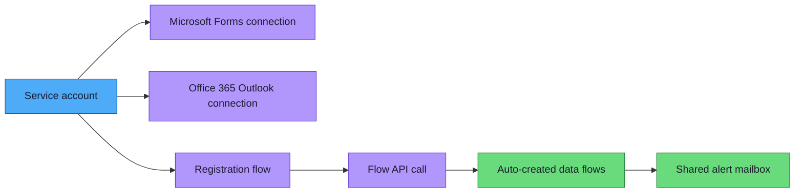

# Service Account Setup Guide

> **Purpose:** Eliminate single-admin dependency. All Power Automate flows and connections should be owned by a shared service account, not a personal account.

---

## Why a Service Account?

The Forms to Fabric pipeline relies on several Power Automate components that are tied to the user who created them:

| Component | Risk if owner leaves |
|-----------|---------------------|
| Registration PA flow | Flow stops running — trigger disconnects |
| Forms connector connection | Connection expires — all flows using it break |
| Auto-created data flows | Created under the Entra HTTP connector user — orphaned |
| Flow API authentication | Entra ID connector session expires |

A **service account** (e.g., `forms-pipeline@yourdomain.com`) owns all these components. When individual admins leave, nothing breaks.

---

## Step 1: Create the Service Account

### 1.1 Create a shared mailbox or user account

In Microsoft Entra ID (Azure Portal → Microsoft Entra ID → Users):

1. Click **+ New user** → **Create new user**
2. Display name: `Forms to Fabric Pipeline`
3. User principal name: `forms-pipeline@yourdomain.com`
4. Auto-generate or set a strong password
5. Click **Create**

`[Screenshot placeholder: Entra ID new user creation form]`

### 1.2 Create a shared mailbox for alerts

In the Microsoft 365 Admin Center (admin.microsoft.com):

1. Go to **Teams & groups** → **Shared mailboxes** → **+ Add a shared mailbox**
2. Name: `Forms to Fabric Alerts`
3. Email: `forms-fabric-alerts@yourdomain.com`
4. Click **Create**
5. Add the service account and admin users as members so they receive alert emails

A shared mailbox requires no additional license and can receive failure notifications from the pipeline.

`[Screenshot placeholder: Shared mailbox creation in M365 Admin Center]`

### 1.3 Assign licenses

The service account needs:
- **Microsoft 365 license** (for Microsoft Forms and Outlook access)
- **Power Automate Premium** (required for the HTTP with Microsoft Entra ID connector used by the registration flow)

Go to Microsoft Entra ID → Users → `forms-pipeline@yourdomain.com` → **Licenses** → **+ Assignments** → select the appropriate M365 license.

`[Screenshot placeholder: License assignment page]`

### 1.4 Set password to not expire

```powershell
# Install the Microsoft Graph PowerShell module (one-time)
Install-Module Microsoft.Graph -Scope CurrentUser

# Connect to Microsoft Graph PowerShell
Connect-MgGraph -Scopes "User.ReadWrite.All"

# Set password policy
Update-MgUser -UserId "forms-pipeline@yourdomain.com" -PasswordPolicies "DisablePasswordExpiration"
```

Or in Entra ID → Users → `forms-pipeline@yourdomain.com` → **Authentication methods** → configure accordingly.

### 1.5 Enable MFA (recommended)

Even for service accounts, enable MFA or use Conditional Access policies to restrict sign-in to trusted locations only.

`[Screenshot placeholder: MFA configuration for service account]`

---

## Step 2: Create the Registration Form Under Service Account

The registration Microsoft Form should be owned by the service account so it stays active regardless of staff changes.

### 2.1 Sign in as the service account

1. Open an incognito/private browser window
2. Go to [forms.office.com](https://forms.office.com)
3. Sign in as `forms-pipeline@yourdomain.com`

### 2.2 Create the registration form

Follow the **"Questions to Create"** and **"Form Settings"** sections in [Registration Form Template](registration-form-template.md), then return here. Do not follow the "After Creating the Form" steps — those are for the non-SA path.

Copy the full URL from the browser — you'll paste it when running `Create-RegistrationFlow.ps1` (the script extracts the form ID automatically).

### 2.3 Share the registration form

1. Click **Share** → **Only people in my organization can respond**
2. Copy the share link to distribute to clinicians

`[Screenshot placeholder: Forms sharing settings]`

---

## Step 3: Create Connections Under Service Account

### 3.1 Sign in to Power Automate as the service account

1. Go to [flow.microsoft.com](https://flow.microsoft.com) (still in the SA browser session)
2. Verify you are signed in as `forms-pipeline@yourdomain.com`

### 3.2 Create a Microsoft Forms connection

1. Go to **Data** → **Connections** → **+ New connection**
2. Search for **Microsoft Forms**
3. Click **Create** → sign in with the service account
4. The connection is now owned by the service account

`[Screenshot placeholder: Power Automate Connections page with Forms connection]`

### 3.3 Create an Office 365 Outlook connection

This connection is used to send failure alert emails from auto-created data flows:

1. Go to **Data** → **Connections** → **+ New connection**
2. Search for **Office 365 Outlook**
3. Click **Create** → sign in with the service account
4. Note the connection ID from the URL (e.g., `shared-office365-xxxxxxxx-xxxx-xxxx-xxxx-xxxxxxxxxxxx`)

`[Screenshot placeholder: Office 365 Outlook connection in Power Automate]`

### 3.4 Note the connection names

1. Click on the newly created Forms connection
2. The URL will contain the connection ID, e.g., `shared-microsoftform-xxxxxxxx-xxxx-xxxx-xxxx-xxxxxxxxxxxx`
3. Do the same for the Outlook connection
4. Copy both — you'll need them for the environment variables:
   - `FORMS_CONNECTION_NAME` — the Forms connection ID
   - `OUTLOOK_CONNECTION_NAME` — the Outlook connection ID

`[Screenshot placeholder: Connection details showing connection ID in URL]`

---

## Step 4: Create the Registration Flow Under Service Account



### 4.1 While signed in as the service account

The flow is created under the identity of whoever runs the script, so it must be the service account. Sign in to `az login` as the SA, then pass the Function App details explicitly (the SA doesn't need Azure resource access):

```powershell
az login  # Sign in as forms-pipeline@yourdomain.com
pwsh scripts/Create-RegistrationFlow.ps1 `
  -RegistrationFormUrl "https://forms.office.com/Pages/DesignPageV2.aspx?...&id=..." `
  -FunctionAppUrl "https://<func-app-name>.azurewebsites.net" `
  -FunctionAppKey "<function-key>"
```

> **Tip:** The admin can get the Function App URL and key from the `azd up` output or by running `az functionapp keys list` under their own account, then hand them to the SA operator.

Key points:
- The flow is created under the service account's identity
- The trigger connection uses the service account's Forms connection
- The Entra HTTP connector authenticates as the service account
- The registration form ID comes from step 2.2

Alternatively, follow the manual steps in the collapsed "Manual alternative" section of [Registration Form Template — Step 2](registration-form-template.md#step-2--create-the-power-automate-flow) while signed in as the service account.

---

## Step 5: Update Environment Variables

Update the Function App with the service account's connection names and alert settings:

```powershell
az functionapp config appsettings set `
  --name <func-app-name> `
  --resource-group <rg-name> `
  --settings "FUNCTION_APP_KEY=<current-function-key>" `
             "ADMIN_EMAIL=forms-pipeline@yourdomain.com" `
             "FORMS_CONNECTION_NAME=shared-microsoftform-<service-account-connection-id>" `
             "OUTLOOK_CONNECTION_NAME=shared-office365-<service-account-connection-id>" `
             "ALERT_EMAIL=forms-fabric-alerts@yourdomain.com"
```

Where:

- `FUNCTION_APP_KEY` is the current host key used in generated per-form flows
- `FORMS_CONNECTION_NAME` and `OUTLOOK_CONNECTION_NAME` come from the Power Automate connection URLs
- `ALERT_EMAIL` points to the shared mailbox or support list that should receive failure alerts

Then redeploy if you also changed code or other deployment assets:

```powershell
pwsh scripts/Redeploy.ps1
```

For app-setting-only changes, a redeploy is usually not required.

---

## Step 6: Transfer Existing Flows (if applicable)

If flows were previously created under a personal account:

### 5.1 Export and re-import

1. In Power Automate (signed in as the old admin), open each flow
2. **Export** → **Package (.zip)**
3. Sign in as the service account
4. **Import** → upload the .zip
5. Re-map connections to the service account's connections
6. Delete the old flow from the personal account

### 5.2 Or recreate from scratch

For the registration flow, it's simpler to recreate using the documented steps. For auto-created data flows, purge and re-register:

```powershell
pwsh scripts/Manage-Registry.ps1 -Purge
# Then re-submit forms through the registration form (now owned by service account)
```

`[Screenshot placeholder: Flow export/import dialog]`

---

## Step 7: Grant Service Account Access

### 6.1 Fabric workspace access

The service account needs Contributor access to the Fabric workspace:

1. Fabric portal → Workspace → Settings → Manage access
2. Add `forms-pipeline@yourdomain.com` as **Contributor**

### 6.2 Azure resource access (optional)

If the service account needs to run admin scripts:

```powershell
az role assignment create `
  --assignee "forms-pipeline@yourdomain.com" `
  --role "Contributor" `
  --scope "/subscriptions/<sub-id>/resourceGroups/<rg-name>"
```

---

## Step 8: Document the Service Account

Add the service account details to your organization's IT documentation:

| Detail | Value |
|--------|-------|
| **Account** | `forms-pipeline@yourdomain.com` |
| **Purpose** | Owns all Forms to Fabric PA flows and connections |
| **Password stored in** | Azure Key Vault or organization's password manager |
| **MFA** | Enabled (or restricted by Conditional Access) |
| **License** | Microsoft 365 E3/E5 (or equivalent) |
| **Owned flows** | Registration Intake + all auto-created data flows |
| **Owned connections** | Microsoft Forms, Office 365 Outlook, HTTP with Entra ID |

---

## Multi-Admin Access

Multiple admins can manage the pipeline without the service account's password:

| Task | How | Service account needed? |
|------|-----|------------------------|
| View flow run history | Power Platform admin center | No |
| Edit flows | Co-owner on the flow (add admins as co-owners) | No |
| Run admin scripts | `az login` with personal account | No |
| Manage registry | `Manage-Registry.ps1` uses Azure CLI | No |
| Validate registration flow | `Validate-RegistrationFlow.ps1` uses Azure CLI | No |
| Create new PA flow connections | Sign in as service account | Yes |
| Modify registration flow trigger | Sign in as service account | Yes |

### Adding co-owners to flows

So other admins can edit flows without the service account password:

1. Sign in to Power Automate as the service account
2. Open the registration flow → **Share** → add admin users as **Co-owners**
3. Co-owners can edit, enable/disable, and view run history

`[Screenshot placeholder: Flow sharing/co-owner dialog]`

---

## Checklist

- [ ] Service account created in Entra ID
- [ ] Shared mailbox created (`forms-fabric-alerts@yourdomain.com`)
- [ ] M365 license assigned
- [ ] Password set to not expire
- [ ] MFA configured
- [ ] Registration Microsoft Form created under service account
- [ ] Registration form shared with organization
- [ ] Forms connection created under service account
- [ ] Outlook connection created under service account
- [ ] Registration flow created under service account (`Create-RegistrationFlow.ps1`)
- [ ] `FORMS_CONNECTION_NAME` updated in Function App
- [ ] `OUTLOOK_CONNECTION_NAME` updated in Function App
- [ ] `ALERT_EMAIL` updated in Function App
- [ ] Redeployed (`pwsh scripts/Redeploy.ps1`)
- [ ] Existing flows transferred or re-created
- [ ] Service account has Fabric workspace access
- [ ] Service account details documented
- [ ] Admin co-owners added to flows
- [ ] Original personal-account flows deleted
