# Forms to Fabric — Setup Guide

> **Audience:** DevOps engineers and IT administrators
> **Time:** ~45 minutes end-to-end

---

## Prerequisites

For a comprehensive list of all tools, packages, APIs, and configurations, see [Deployment Prerequisites](deployment-prerequisites.md).

| Requirement | Details |
|---|---|
| **Azure subscription** | Contributor access |
| **Microsoft 365 account** | Organizational account with Forms access |
| **Microsoft Fabric** | F2+ capacity (existing, or the setup script creates one) |
| **Azure Developer CLI** | v1.5+ — [install](https://learn.microsoft.com/azure/developer/azure-developer-cli/install-azd) |
| **Azure CLI** | Latest — [install](https://learn.microsoft.com/cli/azure/install-azure-cli) |
| **PowerShell 7+** | [install](https://learn.microsoft.com/powershell/scripting/install/installing-powershell) |
| **Python** | 3.11+ |
| **Power Automate Premium** | Required for auto flow creation. Standard license works for manual import. |

---

## Overview

| Step | What | How | Time |
|------|------|-----|------|
| 1 | Clone the repo | `git clone` | 1 min |
| 2 | Set up environment + Fabric | `Setup-Environment.ps1` | ~10 min |
| 3 | Deploy Azure infrastructure | `azd up` + `Post-Deploy.ps1` | ~15 min |
| 4 | Set up self-service registration | Create registration form + PA flow | ~15 min |
| 5 | Test the pipeline | Submit a test response → verify both flows run → check Lakehouse | ~5 min |
| 6 | Configure Power BI | Connect to Lakehouse | ~10 min |

```mermaid
flowchart LR
    Setup["Setup-Environment.ps1"] --> Deploy["azd up"]
    Deploy --> PostDeploy["Post-Deploy.ps1"]
    PostDeploy --> AppSettings["Configure flow app settings"]
    AppSettings --> Registration["Create registration form and flow"]
    Registration --> Test["Submit test registration and test response"]
    Test --> Reporting["Connect Power BI to the Lakehouse"]

    classDef primary fill:#4dabf7,stroke:#1864ab,color:#1a1a2e
    classDef success fill:#69db7c,stroke:#2b8a3e,color:#1a1a2e
    classDef info fill:#b197fc,stroke:#6741d9,color:#1a1a2e

    class Setup,Deploy,PostDeploy info
    class AppSettings,Registration primary
    class Test,Reporting success
```



---

## Step 1: Clone the Repository

```bash
git clone <YOUR_REPO_URL> forms-to-fabric
cd forms-to-fabric
```

Optional but recommended for contributors: install the local pre-commit hook so Bicep is validated before each commit.

```bash
sh scripts/install-hooks.sh
```

---

## Step 2: Set Up Environment and Fabric

A single script configures your azd environment, creates the resource group, provisions Fabric capacity (optional), and creates the workspace + Lakehouse.

```powershell
az login
pwsh scripts/Setup-Environment.ps1
```

Subscription ID and admin email are auto-detected from your Azure CLI login. If you do not pass `-Location`, the script uses its built-in default of `centralus`, selects the target Azure subscription explicitly, and runs a preflight validation before it tells you to run `azd up`.

**Common options:**

```powershell
# Use a different region
pwsh scripts/Setup-Environment.ps1 -Location eastus

# Skip capacity creation (use your org's existing capacity)
pwsh scripts/Setup-Environment.ps1 -SkipCapacity

# Override all defaults
pwsh scripts/Setup-Environment.ps1 -SubscriptionId "<id>" -AdminEmail "you@org.com" -Location eastus

# Skip the final preflight validation if you need to troubleshoot manually
pwsh scripts/Setup-Environment.ps1 -SkipValidation
```

| Parameter | Default | Description |
|-----------|---------|-------------|
| `-SubscriptionId` | Auto-detected | Azure subscription ID |
| `-AdminEmail` | Auto-detected | Fabric admin + notification email |
| `-EnvironmentName` | `dev` | azd environment name |
| `-Location` | `centralus` | Azure region |
| `-SkipCapacity` | off | Skip Fabric capacity creation. You must attach the workspace to an existing capacity yourself. |
| `-SkipValidation` | off | Skip the final `Validate-Environment.ps1` preflight check before `azd up` |
| `-CapacityName` | `formstofabric{env}` | Capacity name (alphanumeric only) |
| `-FabricSku` | `F2` | Fabric SKU (F2–F64) |

The script outputs the workspace and Lakehouse IDs, sets them in your azd environment automatically, and then validates the Bicep deployment inputs. If a soft-deleted Key Vault name would block deployment, the validation step prints the exact purge command before you run `azd up`.

<details>
<summary><strong>Manual alternative</strong></summary>

If the automated script doesn't work in your environment:

**2a. Configure azd:**

```powershell
azd env new dev
azd env set AZURE_LOCATION centralus
azd env set AZURE_SUBSCRIPTION_ID <your-subscription-id>
azd env set ADMIN_EMAIL you@yourdomain.com
```

**2b. Create resource group + Fabric capacity:**

```powershell
az group create --name rg-forms-to-fabric-dev --location centralus

$adminEmail = azd env get-value ADMIN_EMAIL
az deployment group create `
  --resource-group rg-forms-to-fabric-dev `
  --template-file infra/modules/fabric-capacity.bicep `
  --parameters capacityName=formstofabricdev skuName=F2 adminMembers="['$adminEmail']"
```

**2c. Create workspace + Lakehouse:**

```powershell
pwsh scripts/Setup-FabricWorkspace.ps1 -CapacityId "<capacity-id>"
azd env set FABRIC_WORKSPACE_ID <workspace-id>
azd env set FABRIC_LAKEHOUSE_ID <lakehouse-id>
```

**2d. Or create workspace manually:**

1. Go to [app.fabric.microsoft.com](https://app.fabric.microsoft.com) → Workspaces → New workspace
2. Create a Lakehouse named `forms_lakehouse`
3. Copy IDs from the browser URL and set them with `azd env set`

</details>

---

## Step 3: Deploy Azure Infrastructure

```powershell
azd up
```

This packages the Python function app, provisions Azure resources via Bicep, and deploys the code.

Then run the post-deploy script to grant Fabric access and store the function key:

```powershell
pwsh scripts/Post-Deploy.ps1
```

This automatically:
- Grants the Function App managed identity **Contributor** access to your Fabric workspace
- Retrieves the function key and stores it in Key Vault
- Prints the Function App URL (needed for the Power Automate flow)

### 3.1 Configure app settings for auto-created flows

Before clinicians submit the registration form, set the Function App settings used when generating per-form flows:

```powershell
az functionapp config appsettings set `
  --name <func-app-name> `
  --resource-group <rg-name> `
  --settings "FUNCTION_APP_KEY=<current-function-key>" `
             "FORMS_CONNECTION_NAME=shared-microsoftform-<forms-connection-id>" `
             "OUTLOOK_CONNECTION_NAME=shared-office365-<outlook-connection-id>" `
             "ALERT_EMAIL=forms-fabric-alerts@yourdomain.com"
```

Where each value comes from:

- `FUNCTION_APP_KEY` - the current host key retrieved by `Post-Deploy.ps1`
- `FORMS_CONNECTION_NAME` - the Microsoft Forms connection owned by your service account
- `OUTLOOK_CONNECTION_NAME` - the Office 365 Outlook connection used by the generated failure-alert action
- `ALERT_EMAIL` - the mailbox or distribution list that should receive pipeline failure alerts

> Recommended: complete [Service Account Guide](service-account-guide.md) before Step 4 so the Forms and Outlook connection IDs are already available.

**For later code-only updates:** use `pwsh scripts/Redeploy.ps1` to redeploy the Azure Function via remote build without reprovisioning infrastructure. Continue using `azd up` when you change Bicep or other Azure resources.

**Resources created by `azd up`:**

| Resource | Purpose |
|---|---|
| Function App | Processes form responses (Python, Consumption plan) |
| Storage Account | Backing store for the Function App |
| Application Insights | Monitoring and diagnostics |
| Key Vault | Secrets management |
| Managed Identity | Authenticates to Fabric and Key Vault |

---

## Step 4: Set Up Self-Service Registration

The registration form + flow handles everything: form registration, data pipeline flow creation, and notifications.

### 4.1 Create the registration form

Follow [Registration Form Template](registration-form-template.md) to create a "Register Your Form for Analytics" form with 3 questions:
1. Paste your form's share link
2. Give your form a short name
3. Does this form collect any patient information? (Yes / No)

### 4.2 Create the registration Power Automate flow

Run the helper script to get the current HTTP action values:

```powershell
pwsh scripts/Generate-FlowBody.ps1 -Registration
```

Then build the flow with these steps:

1. **Trigger**: When a new response is submitted → select "Register Your Form for Analytics"
2. **Get response details** → same form, Response Id from trigger
3. **HTTP POST** to `/api/register-form`:
   - Paste the URI, headers, and body from `Generate-FlowBody.ps1 -Registration`
   - Rename this action to **`RegisterForm`** so the expressions below work
4. **Condition** → Status code of `RegisterForm` ≠ `200`
5. **If no** (success): Add **Invoke an HTTP request** using **HTTP with Microsoft Entra ID**
   - Resource URI: `https://service.flow.microsoft.com`
   - Base URL: `https://api.flow.microsoft.com`
   - Method: `POST`
   - URL: `/providers/Microsoft.ProcessSimple/environments/Default-<TENANT-ID>/flows`
   - Body (Expression tab): `body('RegisterForm')?['flow_create_body']`
6. **If yes** (error): Add **Send an email V2** to notify the admin or support mailbox
7. **Save** and enable the flow

> ⚠️ **The normal path does not call `GET /api/generate-flow`.** The `register-form` response already contains `flow_create_body`, which the Flow API step posts directly.

### 4.3 Test the registration flow

1. Submit a test entry via the registration form with a real form URL
2. Check Power Automate flow run history → should show Succeeded
3. Verify TWO things were created:
   - The form appears in the registry: `pwsh scripts/Manage-Registry.ps1 -List`
   - A new data pipeline flow appears in Power Automate: `Forms to Fabric - {form name}`

---

## Step 5: Test the Pipeline

1. Open your data form and submit a test response
2. Check Power Automate → flow run history for "Forms to Fabric - {form name}" → should show Succeeded
3. Check Fabric Lakehouse → Tables → look for `{table_name}_raw`
4. If the form has PHI fields classified, also check `{table_name}_curated`

> **Note:** Tables are named `{target_table}_raw` and `{target_table}_curated` in Delta Lake format. The `target_table` is auto-derived from the form name during registration.
>
> If the Fabric capacity is suspended, the generated per-form flow now sends a failure email to `ALERT_EMAIL`. Resume the capacity, then re-run the failed flow.

---

## Step 6: Configure Power BI (Optional)

1. Open Power BI → Get data → Microsoft Fabric → Lakehouses
2. Select your workspace and Lakehouse
3. Choose **DirectLake** mode
4. Build visuals: response counts, trends, answer breakdowns
5. Publish to your Fabric workspace

---

## Fallback: Manual Registration

If the self-service registration form isn't available, use the PowerShell script to list existing forms and manage the registry:

```powershell
pwsh scripts/Manage-Registry.ps1 -List
```

To register a new form manually, use the self-service registration form or call the `POST /api/register-form` endpoint directly. See the [Admin Guide](admin-guide.md) for details.

---

## Troubleshooting

| Symptom | Cause | Fix |
|---|---|---|
| 401 Unauthorized | Invalid function key | Check Key Vault secret or regenerate key |
| 404 on function endpoint | Functions not registered | See "Functions not loading" below |
| Data not in Lakehouse | Managed identity lacks access | Grant Function App Contributor on workspace |
| 503 Service Unavailable with "Fabric capacity is paused or unavailable" | Fabric capacity is suspended | Resume the capacity in Azure Portal or run the Fabric Capacity workflow |
| De-id not applied | Missing field config | Edit the blob registry to add field configuration |
| Function timeout | Large payload | Increase `functionTimeout` in `host.json` |
| Form not registered | form_id mismatch | Verify form_id: `pwsh scripts/Manage-Registry.ps1 -List` |
| Storage 403 Forbidden | Subscription blocks shared key access | Add `SecurityControl=Ignore` tag to storage account |
| Auto-created flow fails before reaching the function | Missing `FUNCTION_APP_KEY`, `FORMS_CONNECTION_NAME`, `OUTLOOK_CONNECTION_NAME`, or `ALERT_EMAIL` | Set the Function App app settings from Step 3.1 and recreate the form flow |
| Local commits miss Bicep validation | Git hook not installed | Run `sh scripts/install-hooks.sh` from the repo root |

### Functions not loading after deployment

If `azd deploy` succeeds but endpoints return 404:

1. **Check Python version matches** — the Function App must run Python 3.11:
   ```powershell
   az functionapp config show --name <func-name> --resource-group <rg> --query "linuxFxVersion"
   # Should show "Python|3.11"
   ```

2. **Verify remote build ran** — check deployment logs for "pip install":
   ```powershell
   az functionapp log deployment show --name <func-name> --resource-group <rg> --query "[-3:].[message]" -o tsv
   # Should show "Deployment successful"
   ```

3. **If remote build fails silently** — your subscription may block shared key access. Add the `SecurityControl=Ignore` tag:
   ```powershell
   az storage account update --name <storage-name> --resource-group <rg> --allow-shared-key-access true --tags SecurityControl=Ignore
   ```

4. **Test directly** — `az functionapp function list` has a delay with v2 Python. Hit the endpoint instead:
   ```powershell
   $key = az functionapp keys list --name <func-name> --resource-group <rg> --query "functionKeys.default" -o tsv
   Invoke-WebRequest -Uri "https://<func-name>.azurewebsites.net/api/process-response?code=$key" -Method POST -Body '{}' -ContentType "application/json"
   # Should return 400 (validation error) — that means it's working
   ```

---

## Next Steps

- [Admin Guide](admin-guide.md) — Operations, monitoring, key rotation
- [Architecture](architecture.md) — Design, security, compliance
- [Pilot Program](pilot-program.md) — Planning a pilot rollout

## Teardown

To remove everything and start fresh:

```powershell
pwsh scripts/Destroy-Environment.ps1 -ResourceGroup "rg-forms-to-fabric-dev"
```

See the [Teardown and Cleanup](admin-guide.md#teardown-and-cleanup) section of the Admin Guide for full details.
