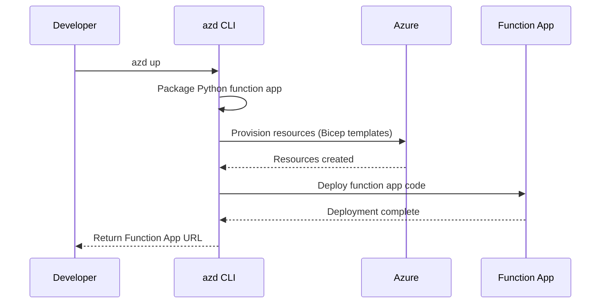
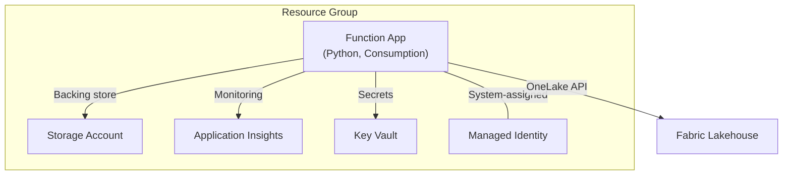
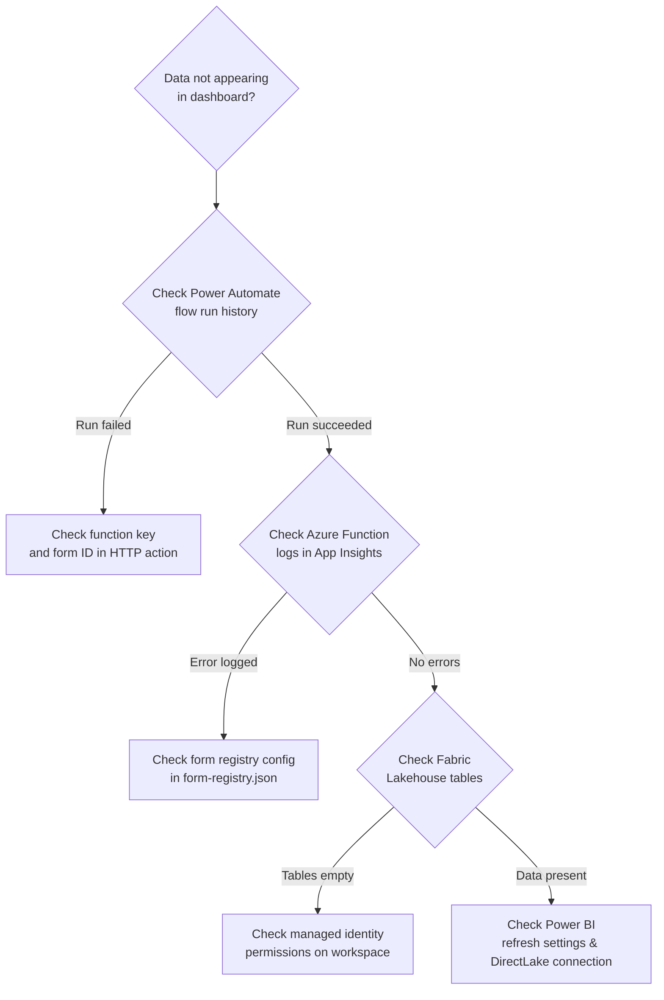

# Forms-to-Fabric Pipeline — Setup Guide

This guide walks you through deploying the complete Forms-to-Fabric pipeline, from infrastructure provisioning to end-to-end validation. It is intended for DevOps engineers and IT administrators responsible for standing up the solution in an Azure + Microsoft Fabric environment.

---

## Prerequisites

Before you begin, ensure you have the following:

| Requirement | Details |
|---|---|
| **Azure subscription** | Contributor access (or higher) on the target subscription |
| **Microsoft 365 account** | Organizational account with access to Microsoft Forms |
| **Microsoft Fabric capacity** | F2 or higher, or Power BI Premium P1 capacity |
| **Azure Developer CLI (`azd`)** | v1.5 or later — [install instructions](https://learn.microsoft.com/azure/developer/azure-developer-cli/install-azd) |
| **Python** | 3.10 or later |
| **Git** | Any recent version |
| **Power Automate license** | Included in most Microsoft 365 business and enterprise plans |
| **Azure CLI** *(optional)* | Useful for advanced configuration and debugging — [install instructions](https://learn.microsoft.com/cli/azure/install-azure-cli) |

> **Tip:** Run `azd version` and `python --version` to verify your tooling before proceeding.

---

## Step 1: Clone the Repository

```bash
git clone <YOUR_REPO_URL> forms-solution
cd forms-solution
```

Verify the directory structure matches the expected layout:

```
forms-solution/
├── infra/              # Bicep infrastructure templates
├── src/functions/      # Azure Function App (Python)
├── config/             # Form registry configuration
├── power-automate/     # Power Automate flow templates
├── power-bi/           # Power BI report templates
├── docs/               # Documentation
├── tests/              # Unit and integration tests
└── azure.yaml          # Azure Developer CLI manifest
```

---

## Step 2: Configure Environment Variables

### 2.1 Create a new `azd` environment

```bash
azd env new dev
```

Replace `dev` with a meaningful name for your environment (e.g., `staging`, `prod-canadaeast`).

### 2.2 Set required variables

Configure each variable using `azd env set`:

```bash
# Azure region — choose a region that meets your data-residency requirements
azd env set AZURE_LOCATION canadaeast

# Target Azure subscription
azd env set AZURE_SUBSCRIPTION_ID <your-subscription-id>

# Microsoft Fabric workspace ID (see Step 4 if you don't have one yet)
azd env set FABRIC_WORKSPACE_ID <your-workspace-guid>

# Microsoft Fabric Lakehouse ID (see Step 4 if you don't have one yet)
azd env set FABRIC_LAKEHOUSE_ID <your-lakehouse-guid>

# Admin email address for error notifications
azd env set ADMIN_EMAIL admin@yourdomain.com
```

> **Note:** If you haven't created your Fabric workspace and Lakehouse yet, you can skip `FABRIC_WORKSPACE_ID` and `FABRIC_LAKEHOUSE_ID` for now, complete Step 4, then return here to set them before deploying.

### 2.3 Verify your configuration

```bash
azd env get-values
```

Confirm that all variables are set correctly before proceeding.

---

## Step 3: Deploy Infrastructure

### 3.1 Run the deployment

```bash
azd up
```

`azd up` performs three actions in sequence:

1. **Package** — builds and packages the Python function app from `src/functions/`.
2. **Provision** — deploys the Bicep templates in `infra/` to create Azure resources.
3. **Deploy** — publishes the function app code to the newly provisioned Function App.



### 3.2 Resources created

The deployment provisions the following resources inside a new Resource Group:

| Resource | Purpose |
|---|---|
| **Azure Function App** | Python function on a Consumption plan that processes form responses |
| **Storage Account** | Backing store for the Function App and intermediate data |
| **Application Insights** | Logging, tracing, and monitoring for the function |
| **Key Vault** | Secure storage for secrets (Fabric credentials, function keys) |
| **Managed Identity** | System-assigned identity used to authenticate to Fabric and Key Vault |



### 3.3 Capture deployment outputs

After `azd up` completes, note the following outputs — you will need them in later steps:

```
FUNCTION_APP_URL=https://<your-function-app>.azurewebsites.net
```

Retrieve the function key for the `process_response` function:

```bash
# Using Azure CLI
az functionapp keys list \
  --name <your-function-app-name> \
  --resource-group <your-resource-group> \
  --query "functionKeys.default" -o tsv
```

Save the **Function App URL** and **function key** — you will need both when configuring the Power Automate flow.

---

## Step 4: Set Up Fabric Workspace and Lakehouse

### 4.1 Create a workspace

1. Navigate to [Microsoft Fabric](https://app.fabric.microsoft.com).
2. Click **Workspaces** → **New workspace**.
3. Enter a name (e.g., `Clinical Forms Analytics`).
4. Under **Advanced**, assign the workspace to your Fabric capacity (F2+ or Premium P1).
5. Click **Apply**.

### 4.2 Create a Lakehouse

1. Inside the new workspace, click **+ New item** → **Lakehouse**.
2. Name it `forms_lakehouse`.
3. Click **Create**.

### 4.3 Note the workspace and Lakehouse IDs

Both IDs are GUIDs found in the browser URL when you are inside the Lakehouse:

```
https://app.fabric.microsoft.com/groups/<WORKSPACE_ID>/lakehouses/<LAKEHOUSE_ID>
```

If you deferred setting these in Step 2, go back and set them now:

```bash
azd env set FABRIC_WORKSPACE_ID <workspace-guid>
azd env set FABRIC_LAKEHOUSE_ID <lakehouse-guid>
```

Then re-deploy the function app to pick up the new configuration:

```bash
azd deploy
```

### 4.4 Grant the Function App access

The Azure Function authenticates to Fabric using its system-assigned managed identity. You must grant this identity access to the workspace:

1. In the Fabric portal, open your workspace settings (⚙️ → **Manage access**).
2. Click **Add people or groups**.
3. Search for the name of your Azure Function App (it will appear as an enterprise application).
4. Assign the **Contributor** role.
5. Click **Add**.

### 4.5 Initial tables

You do **not** need to create tables manually. The `process_response` function automatically creates the required raw and curated tables in the Lakehouse on first run.

---

## Step 5: Create the Power Automate Flow

A pre-built template is available at `power-automate/flow-template.json`. Follow the steps below to create the flow manually, or import the template directly.

### 5.1 Create the flow

1. Go to [Power Automate](https://flow.microsoft.com).
2. Click **+ Create** → **Automated cloud flow**.
3. Name the flow (e.g., `Form Response → Fabric Pipeline`).
4. Select the trigger **When a new response is submitted** (Microsoft Forms).
5. Click **Create**.

### 5.2 Configure the trigger

1. In the trigger, select the Microsoft Form you want to monitor from the **Form Id** dropdown.

### 5.3 Add "Get response details"

1. Click **+ New step** → search for **Get response details** (Microsoft Forms).
2. Set **Form Id** to the same form selected in the trigger.
3. Set **Response Id** to the dynamic value `Response Id` from the trigger.

### 5.4 Add the HTTP action

1. Click **+ New step** → search for **HTTP**.
2. Configure the action:

| Field | Value |
|---|---|
| **Method** | `POST` |
| **URI** | `https://<your-function-app>.azurewebsites.net/api/process_response?code=<your-function-key>` |
| **Headers** | `Content-Type`: `application/json` |
| **Body** | See below |

Body template:

```json
{
  "form_id": "<your-form-id>",
  "response_id": "@{triggerOutputs()?['body/resourceData/responseId']}",
  "responder": "@{outputs('Get_response_details')?['body/responder']}",
  "submit_date": "@{outputs('Get_response_details')?['body/submitDate']}",
  "answers": @{outputs('Get_response_details')?['body']}
}
```

> **Tip:** Replace `<your-form-id>` with the actual Form ID, and `<your-function-key>` with the key retrieved in Step 3.

### 5.5 Add error handling

1. After the HTTP action, click **+ New step** → **Condition**.
2. Set the condition: `Status code` **is not equal to** `200`.
3. In the **If yes** branch, add a **Send an email (V2)** action to notify the admin:
   - **To:** your admin email address
   - **Subject:** `Pipeline Error — Form Response Processing Failed`
   - **Body:** Include the HTTP status code and response body for debugging.
4. Leave the **If no** branch empty (success — no action needed).

### 5.6 Save and test

1. Click **Save**.
2. Turn on the flow if it is not already enabled.

Refer to `power-automate/flow-template.json` for the exact connector configuration and expression syntax.

> **Zero-downtime key rotation:** For production deployments, use the Key Vault–integrated flow template at `power-automate/flow-template-keyvault.json`. This template reads the function key from Key Vault at runtime, so key rotations don't require updating any flows. See the [Admin Guide](admin-guide.md#rotating-secrets-in-key-vault) for details.

---

## Step 6: Register Your First Form

The function app uses `config/form-registry.json` to determine how to process each form's responses, including field mapping and de-identification rules.

### 6.1 Open the registry file

```bash
code config/form-registry.json
```

> **Recommended:** Instead of editing JSON manually, use the registry CLI:
> ```bash
> python scripts/manage_registry.py add-form --form-id "abc123def456" --form-name "Patient Intake Survey" --target-table "patient_intake"
> python scripts/manage_registry.py add-field --form-id "abc123def456" --question-id "r1" --field-name "patient_name" --contains-phi --deid-method "redact"
> python scripts/manage_registry.py validate
> ```
> See the [Admin Guide](admin-guide.md) for full CLI documentation.

### 6.2 Add a new form entry

Add an entry to the `forms` array. Example:

```json
{
  "forms": [
    {
      "form_id": "abc123def456",
      "form_name": "Patient Intake Survey",
      "description": "Initial patient intake form for new clinic visits",
      "target_table": "patient_intake",
      "fields": [
        {
          "question_id": "r1",
          "name": "patient_name",
          "type": "text",
          "sensitivity": "direct",
          "de_identification": "redact"
        },
        {
          "question_id": "r2",
          "name": "date_of_birth",
          "type": "date",
          "sensitivity": "quasi-identifier",
          "de_identification": "generalize_year"
        },
        {
          "question_id": "r3",
          "name": "department",
          "type": "choice",
          "sensitivity": "non-sensitive",
          "de_identification": "none"
        },
        {
          "question_id": "r4",
          "name": "visit_reason",
          "type": "text",
          "sensitivity": "non-sensitive",
          "de_identification": "none"
        }
      ]
    }
  ]
}
```

### 6.3 Field sensitivity levels

| Level | Meaning | Typical Action |
|---|---|---|
| `direct` | Directly identifies an individual (name, email, MRN) | `redact` or `hash` |
| `quasi-identifier` | Could identify when combined with other data (DOB, postal code) | `generalize_year`, `generalize_region`, `mask` |
| `non-sensitive` | No privacy risk | `none` |

### 6.4 Deploy the updated registry

After editing the registry, redeploy to push the new configuration:

```bash
azd deploy
```

---

## Step 7: Test End-to-End

### 7.1 Submit a test response

1. Open your Microsoft Form in a browser.
2. Fill in all fields with recognizable test data (e.g., `Test Patient`, `2000-01-01`).
3. Submit the response.

### 7.2 Check the Power Automate run

1. Go to [Power Automate](https://flow.microsoft.com) → **My flows**.
2. Open the flow and click **Run history**.
3. Verify the latest run shows a **Succeeded** status.
4. If the run failed, click into it to view the step-by-step execution and identify the failing action.

### 7.3 Check Azure Function logs

1. Go to the [Azure portal](https://portal.azure.com).
2. Navigate to **Application Insights** → your instance → **Transaction search**.
3. Filter by the recent time range and look for traces from `process_response`.
4. Alternatively, stream logs live:

```bash
az webapp log tail --name <your-function-app-name> --resource-group <your-resource-group>
```

### 7.4 Verify data in Fabric Lakehouse

1. Open your Lakehouse in the Fabric portal.
2. Check the **Tables** section for your target table (e.g., `patient_intake`).
3. Verify two layers of data:
   - **Raw layer:** Original response data as received from the form.
   - **Curated layer:** Processed data with de-identification rules applied.
4. Click on the table to preview rows and confirm your test data appears correctly.
5. Verify that fields marked as `direct` sensitivity are redacted or hashed in the curated layer.

---

## Step 8: Configure Power BI Dashboard

### 8.1 Connect to the Lakehouse

1. Open **Power BI Desktop** or navigate to Power BI in the Fabric portal.
2. Select **Get data** → **Microsoft Fabric** → **Lakehouses**.
3. Choose your workspace (`Clinical Forms Analytics`) and Lakehouse (`forms_lakehouse`).
4. Select **DirectLake** mode for real-time query performance without data import.

### 8.2 Import the report template

1. Open the template file from the `power-bi/` directory in Power BI Desktop.
2. When prompted, point the data source to your Lakehouse.
3. Click **Load** to connect the template visuals to your data.

### 8.3 Customize the dashboard

1. Update visuals, filters, and slicers to match the fields in your form.
2. Add additional pages or visuals as needed for your use case.
3. Configure **row-level security (RLS)** if required for your organization.

### 8.4 Publish

1. Click **Publish** → select your Fabric workspace.
2. Open the report in the Fabric portal to verify it renders correctly.
3. Share the report with stakeholders or embed it in a Teams channel.

---

## Troubleshooting



| Symptom | Likely Cause | Resolution |
|---|---|---|
| Power Automate flow fails with **401 Unauthorized** | Invalid or expired function key in the HTTP action | Regenerate the function key via the Azure portal or CLI and update the flow's HTTP action URI |
| Data not appearing in Lakehouse | Managed identity lacks permissions on the Fabric workspace | Verify the Function App's managed identity has **Contributor** access on the workspace (Step 4.4) |
| De-identification not applied | Field configuration missing or incorrect in `form-registry.json` | Check that the `sensitivity` and `de_identification` values are set for each field; redeploy with `azd deploy` |
| Function times out (HTTP 504) | Payload too large or downstream Fabric API slow | Check the payload size; increase the function timeout in `host.json` (`functionTimeout`); consider upgrading from Consumption to a Premium plan |
| **"Form not registered"** error in function logs | `form_id` in the Power Automate payload does not match any entry in `config/form-registry.json` | Verify the `form_id` value in the flow's HTTP body matches the `form_id` in the registry; redeploy if you recently added the entry |
| Fabric connection error (403 or 404) | Incorrect workspace/Lakehouse ID, or managed identity not granted access | Double-check `FABRIC_WORKSPACE_ID` and `FABRIC_LAKEHOUSE_ID` in `azd env get-values`; confirm managed identity access in workspace settings |
| Power Automate trigger does not fire | Form is not owned by the connected M365 account, or the trigger is misconfigured | Ensure the Forms connector is signed in with the account that owns the form; verify the correct Form ID is selected in the trigger |
| Application Insights shows no logs | Instrumentation key not set or Application Insights not linked | Verify the `APPINSIGHTS_INSTRUMENTATIONKEY` app setting exists on the Function App; redeploy with `azd up` if missing |

---

## Next Steps

- **[Admin Guide](admin-guide.md)** — Day-to-day operations, monitoring, key rotation, and scaling guidance.
- **[Architecture Overview](architecture.md)** — Detailed architecture diagrams, data flow, and design decisions.
- **[Pilot Program Guide](pilot-program.md)** — Planning and executing a pilot rollout with a clinical department.
